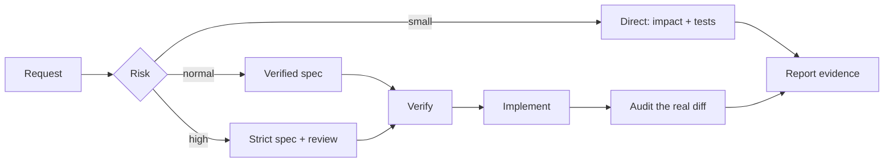

# Mastermind

<p align="center">
  
</p>

<p align="center">
  <a href="https://www.npmjs.com/package/@xcraftmind/mastermind"></a>
  <a href="https://github.com/xcrft/mastermind/actions/workflows/ci-mmcg.yml"></a>
  <a href="LICENSE"></a>
  <a href="evals/scorecard.md"></a>
</p>

**A local codegraph and verifiable workflow for AI coding agents.**

Mastermind gives Claude Code, Codex, Cursor, and Continue a structural view of your code: what exists, who calls it, what a change can affect, and which tests are relevant. Its optional workflow checks an agent's plan and implementation against the real repository instead of trusting the agent's memory.

## What you get

| When you need to… | Mastermind gives you… |
|---|---|
| Understand an unfamiliar repository | Components, entry points, dependencies, hotspots, and cycles |
| Change code safely | Changed symbols, affected callers, API crossings, and blast radius |
| Choose focused tests | Direct, transitive, and heuristic test candidates with evidence |
| Verify agent work | Pre-execution spec checks, post-execution diff audits, and signed evidence |

The codegraph and deterministic style miner stay on your machine in local SQLite
databases. Agent-assisted modes are explicit: `init` without `--no-claude` may
send repository content through the configured Claude CLI, while
`miner profile --deep` sends bounded samples for synthesis.

## Try it in two minutes

Requires Node.js 24+. Prebuilt binaries are included; Rust is not required.

### 1. Install once

```bash
npm install -g @xcraftmind/mastermind
```

Connect the client you use:

```bash
mastermind install --client all                # Claude + Codex workflow adapters and MCP
mastermind setup cursor --scope user --write   # Cursor MCP
mastermind setup continue --scope user --write # Continue MCP
```

Use `mastermind install` for Claude only or `mastermind install --client codex`
for Codex only. `mastermind doctor --workflow --client all` verifies that the
ownership manifests, artifact lists, and SHA-256 content match the current package.

Global installation and MCP registration do **not** require a project or `mastermind init`. Setup is dry-run-first when `--write` is omitted.

### 2. Use it in a repository

```bash
cd your-project
mastermind index .
mastermind map .
mastermind impact --since main
mastermind ui --since main
```

`index` is enough for codegraph, map, and impact features. Run `mastermind init` only when you want the complete spec-driven project workflow:

```bash
mastermind init
mastermind doctor
```

See [Getting started](docs/getting-started.md) for global vs per-repository state, project-local installation, and client-specific setup.

## Core workflows

### Map a project

```bash
mastermind map .                     # readable architecture briefing
mastermind map src --format mermaid  # scoped diagram
mastermind map . --format json       # stable schema for automation
mastermind map . --format sarif      # dependency cycles for GitHub code scanning
mastermind map . --production-only   # hide tests, fixtures, examples, generated/vendor code
```

The map highlights languages, components, entry points, dependency boundaries, hotspots, and cycles without asking an agent to grep the entire repository.

### Review a change in Mastermind Lens

```bash
mastermind ui --since main
mastermind ui --since main \
  --sarif semgrep.sarif --sarif codeql.sarif \
  --coverage lcov.info --coverage cobertura.xml \
  --junit junit.xml --otel traces.json
```

Lens serves a local, read-only, diff-first review UI on an ephemeral loopback
port. It uses the same bounded architecture-map and change-impact schemas as the
CLI/MCP surfaces, adds no CDN or telemetry, and never exposes a write endpoint.
Use `--path`, `--depth`, `--top`, or `--production-only` to narrow a large
monorepo review.

Lens evidence overlays correlate the returned static trace with SARIF findings,
LCOV/Cobertura line coverage, JUnit results, explicit OpenTelemetry code paths,
CODEOWNERS, bounded Git churn/contributors, and exact changed-file mentions in
indexed specs, ADRs, audits, lessons, and context.
The graph topology stays unchanged: overlays add source-labelled marks and
inspector facts rather than an opaque risk score. Lens auto-discovers
`.github/CODEOWNERS`, `CODEOWNERS`, or `docs/CODEOWNERS`; use `--codeowners` to
override it and `--git-commits 0..1000` to control history (`200` by default).
Project-knowledge correlation is enabled by default; use
`--no-project-knowledge` to suppress it. Runtime evidence decorates an existing
static edge only when the two file endpoints match in either direction; it
never creates graph topology.
CODEOWNERS is matched as working-tree syntax only; Lens does not claim that a
listed account has GitHub write access or replace base-branch review policy.
Unreadable, oversized, invalid, or truncated sources remain visible as partial
diagnostics. Reports and history are parsed in memory and are never written to
the repository or codegraph database.

### Understand change and test impact

```bash
mastermind impact --since main
mastermind impact --since HEAD~1 --format json
mastermind impact --since main --format sarif > mastermind-impact.sarif
```

Impact analysis compares a Git baseline with committed, staged, unstaged, and untracked work. It reports symbol-level changes, affected callers, component crossings, and candidate tests. Focused candidates are evidence for prioritization, not a replacement for the repository's required test suite.

The SARIF projections use stable architecture rule IDs and repository-relative
artifact URIs so dependency cycles and cross-component change risks can be
uploaded through GitHub's standard SARIF workflow. They export only returned
bounded findings and preserve partial-result metadata; an empty partial export
is not a clean verdict.

### Review architecture invariants

Use `/mastermind-architecture-review` for changes that cross service, queue,
state, retry, migration, or public-contract boundaries. It reconstructs the
real runtime path and tests source-of-truth ownership, idempotency, and
backward compatibility against concrete failure sequences.

### Review the comments a change left behind

Use `/mastermind-comment-audit` (or the `mastermind-comment-auditor` subagent)
once an implementation is finished. It reviews only the comments that change
added, modified, or deleted: narration is flagged with the code line that already
says it, load-bearing comments are named as kept, and rationale the change
deleted is reported. Write-time comment rules are the first thing an
implementation agent drops, and the mechanical contract cannot see them — so a
reader verifies them, in every mode.

### Ask why the project works this way

```bash
mastermind history "webhook dedupe"
mastermind why "why is webhook dedupe durable?"
```

History searches active and archived `CONTEXT` files, canonical task specs,
executor reports, audits, `.mastermind/releases/`, and reviewed lessons. A
`candidate` lesson is only an audit signal until semantic review. The index is
only a retrieval layer: Markdown remains authoritative, and the answer separates
observed records from inference and missing proof.

### Carry personal style across repositories

```bash
mastermind miner profile .
```

The deterministic miner writes a user-global `~/.mastermind/style.md` and
`style.db`; it works without `mastermind init`. Planner and executor treat the
profile as advisory. Repository code, formatter/linter policy, the approved
contract, product behavior, and security always win. Corpus-level code-shape
observations are diagnostic rather than coding instructions;
`/mastermind-style-deep` adds a qualitative, evidence-backed portrait that normal
re-mining preserves.

### Query the graph from an agent

The MCP server exposes 24 bounded tools for symbol search, callers/callees,
imports, architecture maps, change impact, test impact, cycles, API surface, and
project history. The same engine is available through the CLI.

```text
"Does parseConfig exist?"
"Who calls createSession?"
"What could this branch affect?"
"Which tests are connected to these changes?"
```

See the [mmcg reference](docs/reference/mmcg.md) for the complete tool and protocol contract.

### Use only the workflow depth you need

Small changes stay direct: query the graph, implement, and run the repository
checks. Normal delegated work uses a compact verified contract. Auth,
migrations, public APIs, data-loss, and supply-chain changes use strict review.



Direct mode needs only `mastermind index .`; no `init` or task spec is required.
Verified and strict tasks keep planner, executor, and controller ownership
separate, and post-flight requires a canonical executor report. Read [How the
workflow works](docs/workflow.md) for the exact modes and task lifecycle.

### Produce verifiable audit evidence

Mastermind can seal audit results with SHA-256 integrity and detached Ed25519 signatures. The included GitHub Action verifies repository, baseline, head, worktree, signature, and policy inputs before evidence is published.

See [Verifiable audits and GitHub Action](docs/github-action.md).

## What is global and what is per project?

| State | Scope | Created by |
|---|---|---|
| `mastermind` CLI | Global or project-local npm install | `npm install` |
| Claude workflow agents and skills | Global | `mastermind install` |
| Codex workflow skills | Global | `mastermind install --client codex` |
| MCP client registration | User or project, depending on client | `mastermind setup …` |
| Personal style profile | User-global, optional | `mastermind miner profile` or `mastermind init` |
| `.mastermind/mmcg.db` codegraph | Per repository | `mastermind index .` or `mastermind init` |
| Task specs and project context | Per repository, optional | `mastermind init` |

## Support

- **Clients:** Claude Code, Codex, Cursor, Continue, and generic MCP stdio clients
- **Languages:** Python, TypeScript/TSX, JavaScript/JSX, Vue SFC, Rust, C#, Go, Java, PHP, and C/C++
- **Platforms:** macOS arm64/x64, Linux glibc and musl arm64/x64, Windows x64
- **Privacy:** deterministic parsing and storage are local; explicit agent-assisted modes disclose when repository samples are sent to the configured AI client

The graph is syntactic rather than compiler-semantic. Dynamic dispatch, reflection, re-exports, overload resolution, and cross-language calls can reduce precision. Mastermind reports bounded results and precision notes instead of presenting incomplete analysis as certain.

## Documentation

- [Getting started](docs/getting-started.md)
- [Claude Code](docs/integrations/claude-code.md) · [Codex](docs/integrations/codex.md) · [Cursor](docs/integrations/cursor.md) · [Continue](docs/integrations/continue.md) · [Generic MCP](docs/integrations/generic-mcp.md)
- [Workflow](docs/workflow.md)
- [mmcg technical reference](docs/reference/mmcg.md)
- [GitHub Action and audit security model](docs/github-action.md)
- [Changelog](CHANGELOG.md)

## Build from source

Rust 1.96+ is required for source builds:

```bash
cargo install mmcg
# or from a clone
cargo install --path mcp/servers/mmcg
```

The cargo-installed command is `mmcg`; the npm package exposes the same binary as both `mastermind` and `mmcg`.

## Contributing

See [CONTRIBUTING.md](CONTRIBUTING.md) for the project layout, checks, evals, and pull-request conventions.

## License

MIT — see [LICENSE](LICENSE).
