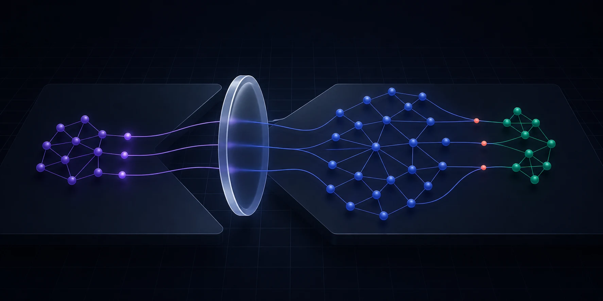
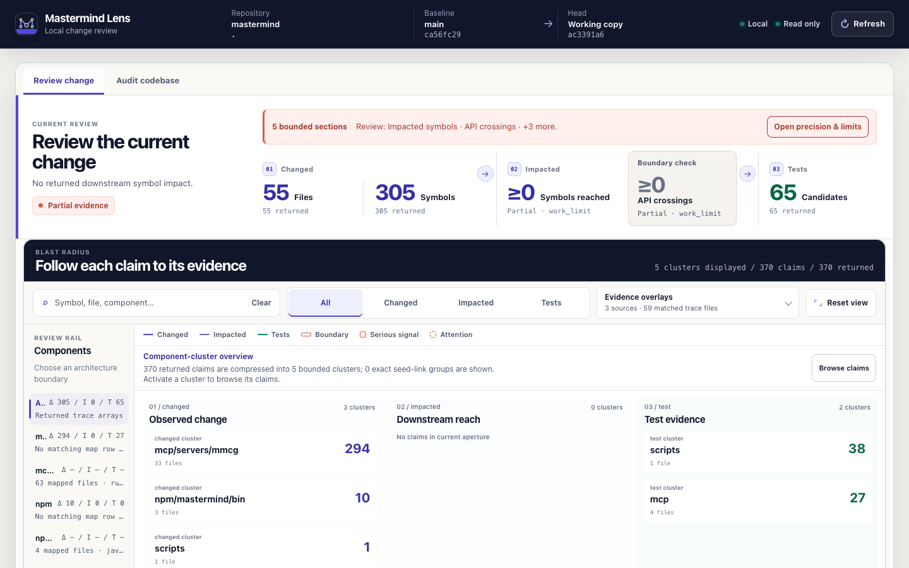
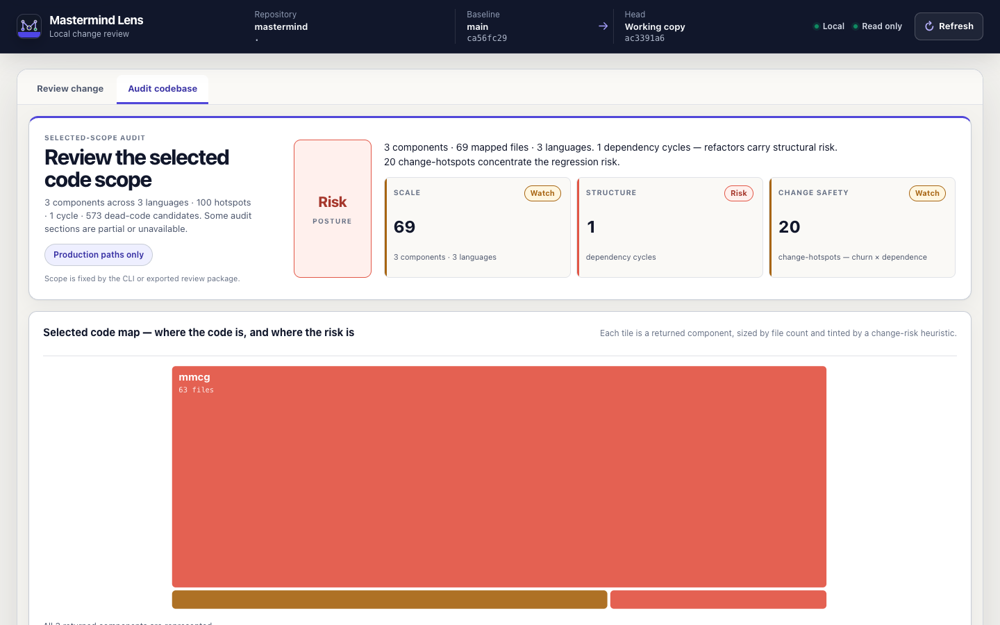
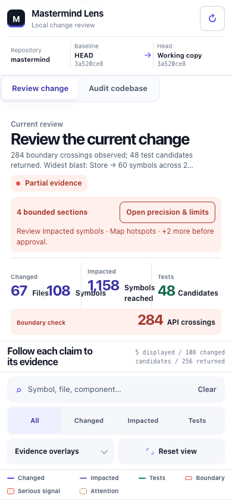
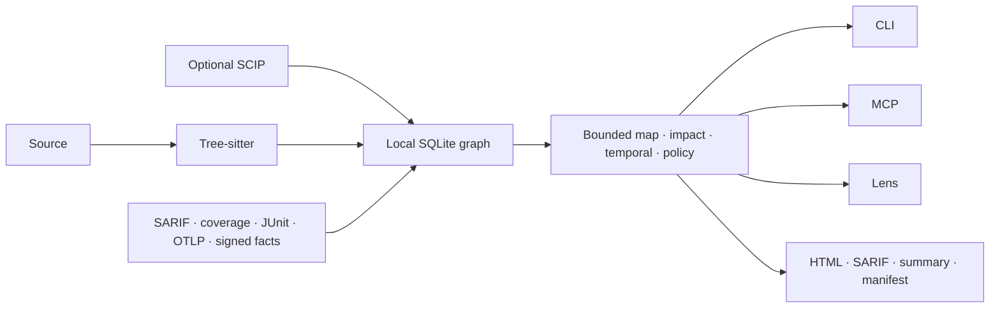

<p align="center">
  
</p>

<h1 align="center">Mastermind</h1>

<p align="center">
  <strong>Review the blast radius, not just the patch.</strong>
</p>

<p align="center">
  A local, diff-first codegraph for architecture review.<br>
  See what changed, what it reaches, and which evidence supports the review—without uploading your repository.
</p>

<p align="center">
  <a href="https://www.npmjs.com/package/@xcraftmind/mastermind"></a>
  <a href="https://crates.io/crates/mmcg"></a>
  <a href="https://github.com/xcrft/mastermind/actions/workflows/ci-mmcg.yml"></a>
  <a href="LICENSE"></a>
</p>

<p align="center">
  <a href="#quick-start">5-minute start</a> ·
  <a href="#the-review-surface-your-diff-is-missing">Product tour</a> ·
  <a href="docs/getting-started.md">Documentation</a> ·
  <a href="docs/reference/mmcg.md#mcp-server-usage">MCP tools</a>
</p>

<p align="center">
  
</p>

## A diff shows lines. Mastermind shows consequences.

A changed function is rarely the whole review. The real question is what that
function reaches: downstream callers, architecture boundaries, candidate tests,
ownership, security findings, runtime traces, and rules the repository is
supposed to keep.

Mastermind turns one revision-bound snapshot into an inspectable review:

```text
changed symbols  →  downstream reach  →  boundary crossings  →  candidate tests
       │                    │                     │                     │
       └──── Git · CODEOWNERS · SARIF · coverage · runtime · decisions ┘
```

Every claim keeps its source. If the index is stale, a query hits its limit, or
evidence is incomplete, Mastermind says so instead of manufacturing a green
check. You get a review another engineer can inspect, challenge, and replay.

## Quick start

The npm package ships native binaries for macOS, Linux, and Windows. You need
Node.js 24+, not a Rust toolchain.

```bash
npm install -g @xcraftmind/mastermind

cd your-repository
mastermind index .
mastermind impact --since main
mastermind brief --role executor --since main --budget-tokens 2000
mastermind ui --since main
```

That is the whole first run. `index` creates a local SQLite graph at
`.mastermind/mmcg.db`. `ui` opens Lens on loopback with embedded assets, no
repository upload, and no CDN. Start with `impact` in the terminal; open Lens
when you want the complete review surface.

`brief` is the one-call agent entry point. It returns a revision-bound planner,
executor, or auditor packet and budgets the final MCP envelope, including JSON
escaping and transport duplication. It includes typed paths and symbols, never
source bodies, declaration signatures, literal/default values, or history
excerpts.

<p align="center">
  
</p>

<p align="center">
  <sub>Lens reviewing Mastermind itself. Limits stay visible instead of being flattened into a false pass.</sub>
</p>

## The review surface your diff is missing

| You need to… | Mastermind gives you… |
|---|---|
| Review the current change | Changed symbols, downstream reach, component crossings, candidate tests, and an evidence inspector |
| Audit the architecture | Components, entry points, cycles, centrality, large-file pressure, ownership concentration, and change hotspots |
| Keep boundaries enforceable | Repository policy checks with text, JSON, and SARIF output |
| Give an agent real context | 30 bounded MCP tools, including local concept search and one revision-bound role brief, over the same local graph |
| Hand the review to anyone | A standalone offline Lens package with HTML, SARIF, summary, and a revision/evidence manifest |

<table>
  <tr>
    <td width="70%">
      
    </td>
    <td width="30%">
      
    </td>
  </tr>
  <tr>
    <td><strong>Audit the selected scope.</strong><br>See structural pressure and change risk without pretending a static graph is runtime truth.</td>
    <td><strong>Review anywhere.</strong><br>The same evidence model works from a 390px viewport to a full review workstation.</td>
  </tr>
</table>

## Evidence, not vibes

- **Local by default.** Deterministic indexing, queries, Lens, policy checks,
  fact ingestion, and review export run on your machine.
- **One snapshot everywhere.** CLI, MCP, Lens, SARIF, and the portable review
  package read the same indexed state.
- **Fail closed.** Repository drift, stale files, snapshot races, missing
  evidence, and unavailable analysis are explicit states.
- **Bounded on purpose.** Work limits, returned totals, truncation, and
  precision notes are part of the result, not hidden implementation details.
- **Provenance survives the join.** Static edges, SCIP facts, runtime
  observations, coverage, test reports, and signed facts keep their identity.

Runtime evidence can corroborate an exact structural edge. It cannot silently
invent graph topology.

## One workflow from terminal to PR

### See the blast radius

```bash
mastermind impact --since main
mastermind brief --role auditor --since main --budget-tokens 2000
mastermind concept "payment retry handler" --top 10
mastermind temporal --since main
mastermind ui --since main --production-only
```

Impact includes committed, staged, unstaged, and untracked changes. Temporal
analysis compares base and head architecture, including public boundaries,
cycles, centrality, hotspots, ownership movement, and project-history records
that may need review.

### Bring the evidence you already trust

```bash
mastermind ui --since main \
  --sarif semgrep.sarif --sarif codeql.sarif \
  --coverage lcov.info --coverage cobertura.xml \
  --junit junit.xml --otel traces.json
```

Lens correlates exact returned trace files with SARIF, LCOV/Cobertura, JUnit,
OpenTelemetry, CODEOWNERS, Git churn, specs, ADRs, audits, lessons, and imported
facts. Each overlay retains its source and completeness state.

### Turn architecture into an executable rule

```yaml
version: 1
rules:
  - id: domain-must-not-import-infrastructure
    from: src/domain/**
    deny_imports: src/infrastructure/**

  - id: payment-blast-radius
    scope: services/payment/**
    max_affected_symbols: 80
```

```bash
mastermind policy check --since main
mastermind policy check --since main --format sarif > mastermind-policy.sarif
```

The policy DSL covers dependency direction, new-cycle and blast-radius budgets,
public API ownership, related tests, ownership crossings, and strict-workflow
evidence. Violations and incomplete required evidence both exit non-zero.

### Export a review that needs no installation

```bash
mastermind review export --since main --out mastermind-review
```

```text
mastermind-review/
├── index.html              # standalone offline Lens
├── mastermind.sarif        # GitHub code scanning input
├── summary.md              # bounded reviewer summary
├── manifest.json           # revisions, digests, partial states
└── mastermind-review.yml   # pinned GitHub Actions workflow
```

The exporter refuses to overwrite an existing directory. External evidence can
be bound to the head revision, and signed fact manifests can carry Ed25519
provenance into the package.

### Give coding agents bounded context

```bash
mastermind install --client all --profile core
mastermind setup cursor --scope user --write
mastermind setup continue --scope user --write
mastermind doctor --workflow --client all
mastermind workflow audit --root .
```

Fresh workflow installs default to the 14-skill `core` profile. Use `frontend`
or `security` for a focused extension, or `full` for all 26 portable skills.
Profiles reduce skill discovery; Claude keeps the complete named-subagent set so
workflow routes do not dangle. `mastermind update` preserves each client's
installed profile unless `--profile` explicitly switches it.

`workflow audit` builds a deterministic, read-only graph from owned agents,
skills, models, MCP servers, tools, artifacts, and writers. Point `--root` at
the repository for source validation or at an installed `.claude`/`.codex`
directory for manifest-scoped validation; add `--json` for the schema-v1 report.

Mastermind supports Claude Code, Codex, Cursor, Continue, and generic MCP stdio
clients. Setup is dry-run-first unless `--write` is present. The MCP surface has
21 non-destructive queries that may refresh the managed derived index, 8
read-only tools, and one additive write to the local gitignored scratchpad.

## How it works



The default graph is syntactic and toolchain-free. Optional
[SCIP](https://github.com/scip-code/scip) data adds compiler-resolved
definitions, references, implementations, and type definitions in separate
tables. [Fact manifests](docs/fact-ingestion-sdk.md) add revision-bound
annotations without loading plugin code or granting SQLite access.

Mastermind is not another hosted graph browser and it does not replace CodeQL,
Joern, a compiler, or an observability backend. It is the review layer that
joins their evidence to one bounded code change.

## Performance you can reproduce

Release-mode synthetic benchmark on an Apple M3 Pro with 12 cores and 36 GB of
memory. Each generated Rust file contained 20 public functions. Changed runs
modified 10% of files.

| Corpus | Cold index | Warm unchanged | 10% changed | Peak RSS |
|---|---:|---:|---:|---:|
| 1,000 files / 20,000 functions | 310 ms | 41 ms | 81 ms | about 19 MiB |
| 10,000 files / 200,000 functions | 3.20 s | 353 ms | 867 ms | about 80 MiB |

Values are medians over 7 and 5 runs. See
[benchmarks](docs/benchmarks.md) for ranges, exact parameters, reproduction
commands, and limits. These are indexing measurements on one machine, not
portable guarantees or competitor comparisons.

## Fits the stack you already have

| | Supported |
|---|---|
| **Languages** | Python, TypeScript/TSX, JavaScript/JSX, Vue SFC, Rust, C#, Go, Java, PHP, and C/C++ |
| **Platforms** | macOS arm64/x64, Linux glibc and musl arm64/x64, Windows x64 |
| **Clients** | Claude Code, Codex, Cursor, Continue, and generic MCP stdio clients |
| **Evidence** | SARIF, LCOV/Cobertura, JUnit, OTLP JSON, CODEOWNERS, Git, SCIP, signed declarative facts |
| **Storage** | Local SQLite with read-only Lens access |

Local multi-repository maps are also available through pinned
[team manifests](docs/team-graph.md). Cross-repository edges exist only when
the manifest declares them.

## The precision contract

The Tree-sitter graph is syntactic. Dynamic dispatch, reflection, generated
code, re-exports, dependency injection, overload resolution, and cross-language
calls may be incomplete. Results carry collision, truncation, stale-index, and
precision notes. Candidate tests and unreferenced symbols are review inputs,
not permission to skip tests or delete code.

Explicit agent-assisted commands are the privacy exception:
`mastermind init` without `--no-claude` may send repository content through the
configured Claude CLI, and `mastermind miner profile --deep` sends bounded
samples for synthesis. Deterministic indexing, Lens, MCP, policy, facts, and
review export remain local.

## Documentation

Pick the shortest path to the answer you need:

| I want to… | Go here |
|---|---|
| See my first impact report | [Getting started](docs/getting-started.md) |
| Look up a command, limit, schema, or MCP tool | [CLI and MCP reference](docs/reference/mmcg.md) |
| Connect Claude Code, Codex, Cursor, Continue, or another client | [Client integrations](docs/integrations) |
| Run Direct, Verified, or Strict delivery | [Review workflow](docs/workflow.md) |
| Import external evidence safely | [Fact-ingestion SDK](docs/fact-ingestion-sdk.md) |
| Publish verifiable audit evidence | [GitHub Action](docs/github-action.md) |
| Reproduce performance numbers | [Benchmarks](docs/benchmarks.md) |
| See what changed between releases | [Changelog](CHANGELOG.md) |

## Build and contribute

Source builds require Rust 1.96+:

```bash
cargo install --path mcp/servers/mmcg --locked
just check
```

The Cargo command is `mmcg`. npm installs the same binary as both `mastermind`
and `mmcg`. See [CONTRIBUTING.md](CONTRIBUTING.md) for repository layout,
focused checks, evals, release packaging, and pull-request requirements.

Report reproducible defects through
[GitHub Issues](https://github.com/xcrft/mastermind/issues). Report security
issues privately under [SECURITY.md](SECURITY.md).

## License

MIT — see [LICENSE](LICENSE).
