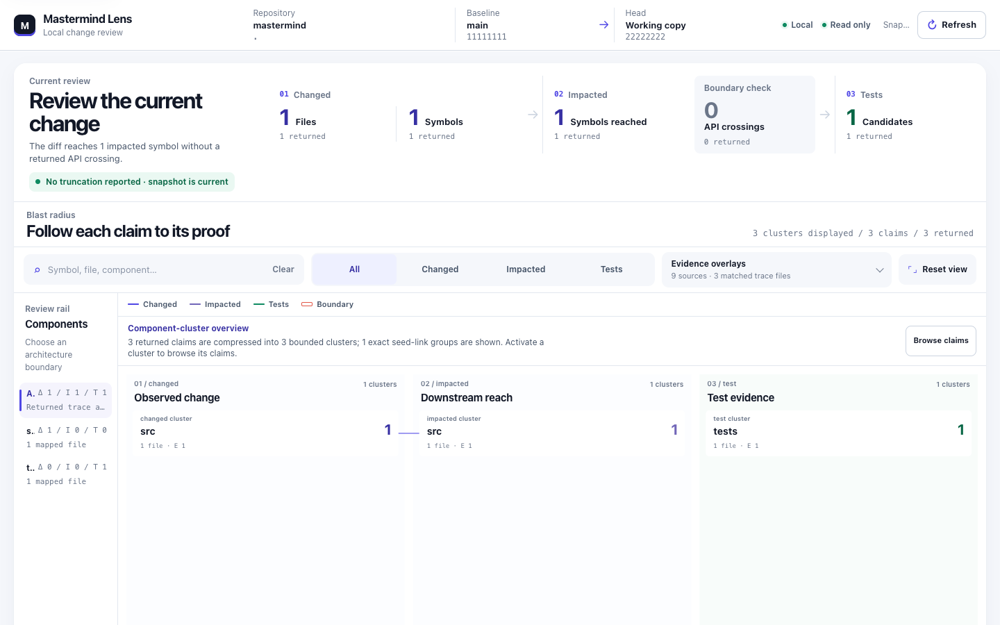
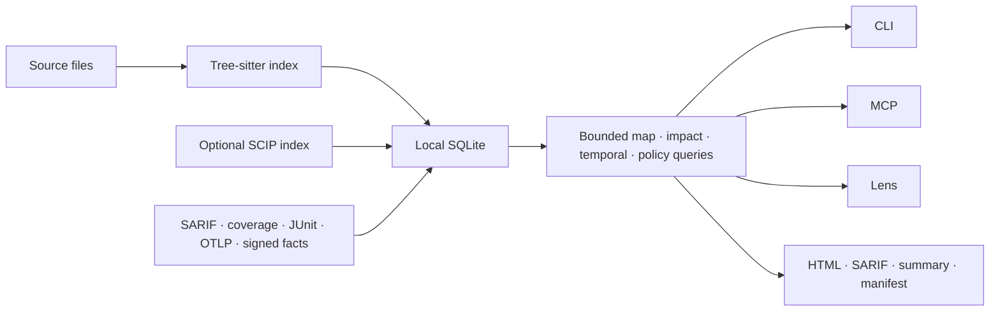

# Mastermind

<p align="center">
  
</p>

<p align="center">
  <a href="https://www.npmjs.com/package/@xcraftmind/mastermind"></a>
  <a href="https://crates.io/crates/mmcg"></a>
  <a href="https://github.com/xcrft/mastermind/actions/workflows/ci-mmcg.yml"></a>
  <a href="LICENSE"></a>
</p>

**A local codegraph for reviewing code changes with traceable evidence.**

Mastermind indexes a repository into SQLite, exposes bounded structural queries
over CLI and MCP, and connects a diff to affected callers, tests, components,
policies, ownership, coverage, runtime traces, and project decisions. The same
snapshot powers the terminal, the read-only Lens UI, SARIF, and a standalone PR
review package.

## Quick start

Requires Node.js 24+. The npm package includes native binaries; Rust is not
required.

```bash
npm install -g @xcraftmind/mastermind

cd your-repository
mastermind index .
mastermind impact --since main
mastermind ui --since main
```

`mastermind index .` creates `.mastermind/mmcg.db`. `ui` opens a loopback-only,
read-only review surface; it does not upload the repository or load a CDN.

<p align="center">
  
</p>

Connect an AI client only if you want MCP or the optional workflow bundle:

```bash
mastermind install --client all                 # Claude Code + Codex
mastermind setup cursor --scope user --write
mastermind setup continue --scope user --write
mastermind doctor --workflow --client all
```

Setup is dry-run-first unless `--write` is present. See
[Getting started](docs/getting-started.md) for project-local installs, generic
MCP clients, updates, removal, and state ownership.

## What it answers

| Question | Command or surface |
|---|---|
| What are the components, entry points, hotspots, and cycles? | `mastermind map .` |
| What can this branch affect? | `mastermind impact --since main` |
| How did architecture change between base and head? | `mastermind temporal --since main` |
| Which tests are structurally connected to the change? | `mastermind impact` or `mmcg_test_impact` |
| Does the change violate a repository rule? | `mastermind policy check --since main` |
| Can a reviewer inspect the result without Mastermind installed? | `mastermind review export --since main --out mastermind-review` |
| Can an agent query symbols, callers, imports, history, and evidence? | 28 MCP tools over stdio |

The MCP surface contains 27 read-only tools and one additive write,
`mmcg_scratchpad_append`, to the local gitignored index. The
[technical reference](docs/reference/mmcg.md#mcp-server-usage) lists every tool and
its bounds.

## How it works



The default graph is syntactic and toolchain-free. Optional
[SCIP](https://github.com/scip-code/scip) data adds compiler-resolved
definitions, references, implementations, and type definitions in separate
tables. [Fact manifests](docs/fact-ingestion-sdk.md) add revision-bound
annotations without loading plugin code or granting SQLite access.

Evidence never silently creates topology. A runtime trace or imported fact can
corroborate an existing exact edge; it cannot invent a caller/callee path.

## Core capabilities

### Diff-first architecture review

```bash
mastermind impact --since main
mastermind temporal --since main
mastermind ui --since main --production-only
```

Impact covers committed, staged, unstaged, and untracked changes. Temporal
analysis reports component and public-boundary drift, new/resolved cycles,
centrality and hotspot movement, ownership changes, and history records that may
need review. Stale indexes, snapshot races, work limits, and truncated evidence
are explicit states rather than clean results.

### Evidence overlays

```bash
mastermind ui --since main \
  --sarif semgrep.sarif --sarif codeql.sarif \
  --coverage lcov.info --coverage cobertura.xml \
  --junit junit.xml --otel traces.json
```

Lens correlates the returned trace with SARIF, LCOV/Cobertura, JUnit,
OpenTelemetry code paths, CODEOWNERS, Git churn, specs, ADRs, audits, lessons,
and imported facts. Each item retains its source and completeness state.

### Portable PR evidence

```bash
mastermind review export --since main --out mastermind-review
```

The output directory contains:

```text
mastermind-review/
├── index.html              # standalone offline Lens snapshot
├── mastermind.sarif        # GitHub code scanning input
├── summary.md              # bounded reviewer summary
├── manifest.json           # revision, evidence digests, partial states
└── mastermind-review.yml   # pinned GitHub Actions workflow
```

The exporter refuses to overwrite an existing directory. External evidence can
be bound to the head revision with a strict attestation; signed fact manifests
carry reproducible Ed25519 provenance into the package.

### Architecture policy as code

```yaml
version: 1
rules:
  - id: domain-must-not-import-infrastructure
    from: src/domain/**
    deny_imports: src/infrastructure/**
  - id: payment-blast-radius
    scope: services/payment/**
    max_affected_symbols: 80
```

```bash
mastermind policy check --since main
mastermind policy check --since main --format sarif > mastermind-policy.sarif
```

The v1 DSL covers dependency direction, new-cycle and blast-radius budgets,
public API ownership, related tests, ownership crossings, and strict-workflow
evidence. Violations and incomplete required evidence both exit non-zero.

### Optional semantic and community evidence

```bash
mastermind enrich --scip index.scip

mastermind facts adapt --format sarif \
  --input semgrep.sarif --output facts.json \
  --producer semgrep --producer-version 1.82.0 --dataset pr-security
mastermind enrich --facts facts.json
```

Built-in adapters support SARIF, LCOV/Cobertura, JUnit, and OTLP JSON. The
[`mastermind-facts/v1` contract](docs/fact-ingestion-sdk.md) checks repository
identity, Git revision, paths, sizes, digests, capabilities, and provenance
before atomically replacing one producer dataset.

### Local multi-repository maps

```bash
mastermind team lock team.json --output team.lock.json
mastermind team map team.lock.json
```

The [team graph](docs/team-graph.md) pins each local repository, revision, and
DB/WAL snapshot. Cross-repository edges exist only when the manifest declares
them; Mastermind does not infer service calls across repositories.

## Performance

Release-mode synthetic benchmark on an Apple M3 Pro, 12 cores, 36 GB memory.
Each generated Rust file contained 20 public functions; changed runs modified
10% of files.

| Corpus | Cold index | Warm unchanged | 10% changed | Peak RSS |
|---|---:|---:|---:|---:|
| 1,000 files / 20,000 functions | 310 ms | 41 ms | 81 ms | about 19 MiB |
| 10,000 files / 200,000 functions | 3.20 s | 353 ms | 867 ms | about 80 MiB |

Values are medians over 7 and 5 runs respectively. See
[benchmarks](docs/benchmarks.md) for ranges, exact parameters, methodology,
reproduction commands, and limits. These are indexing measurements, not
competitor comparisons or portable latency guarantees.

## Where it fits

These projects solve adjacent problems. Choose by the evidence you need rather
than by a generic “code graph” label.

| Tool | Best fit | Difference in focus |
|---|---|---|
| **Mastermind** | Local PR/change review, bounded impact, architecture policy, evidence export, MCP | Diff-first and revision-bound; Tree-sitter by default with optional SCIP and external facts |
| [Graphify](https://github.com/Graphify-Labs/graphify) | Interactive knowledge graphs spanning code, docs, and media | Broader multimodal exploration; Mastermind is narrower around code-change evidence and CI contracts |
| [Joern](https://github.com/joernio/joern) | Code-property-graph and security/data-flow analysis | Deeper security query platform; Mastermind emphasizes repository architecture, change impact, and agent review |
| [CodeQL](https://github.com/github/codeql) | Security queries and GitHub code scanning | Compiler/language-specific security analysis; Mastermind can consume its SARIF as evidence |
| [Glean](https://github.com/facebookincubator/Glean) | Organization-scale source facts and custom indexers | General fact infrastructure; Mastermind keeps a bounded single-repository default in local SQLite |

Mastermind does not replace compiler analysis, security query engines, or a
runtime observability backend. It joins their outputs to one reviewable change
snapshot.

## Support and precision

- **Languages:** Python, TypeScript/TSX, JavaScript/JSX, Vue SFC, Rust, C#, Go,
  Java, PHP, and C/C++.
- **Platforms:** macOS arm64/x64; Linux glibc and musl arm64/x64; Windows x64.
- **Clients:** Claude Code, Codex, Cursor, Continue, and generic MCP stdio
  clients.
- **Storage:** local SQLite; source parsing and normal queries require no
  hosted service.

The Tree-sitter graph is syntactic. Dynamic dispatch, reflection, generated
code, re-exports, dependency injection, overload resolution, and cross-language
calls may be incomplete. Results carry collision, truncation, stale-index, and
precision notes. Candidate tests and unreferenced symbols are review inputs,
not authorization to skip tests or delete code.

Explicit agent-assisted commands are the privacy exception: `mastermind init`
without `--no-claude` may send repository content through the configured Claude
CLI, and `mastermind miner profile --deep` sends bounded samples for synthesis.
Deterministic indexing, Lens, MCP, policy, facts, and review export remain local.

## Documentation

- [Documentation index](docs/README.md)
- [Getting started](docs/getting-started.md)
- [CLI and MCP reference](docs/reference/mmcg.md)
- [Workflow](docs/workflow.md)
- [Fact-ingestion SDK](docs/fact-ingestion-sdk.md)
- [Verifiable GitHub Action](docs/github-action.md)
- [Benchmarks](docs/benchmarks.md)
- [Changelog](CHANGELOG.md)

## Build and contribute

Source builds require Rust 1.96+:

```bash
cargo install --path mcp/servers/mmcg --locked
just check
```

The Cargo command is `mmcg`; npm installs the same binary as both `mastermind`
and `mmcg`. See [CONTRIBUTING.md](CONTRIBUTING.md) for repository layout,
focused checks, evals, release packaging, and pull-request requirements.

Report reproducible defects through
[GitHub Issues](https://github.com/xcrft/mastermind/issues). Report security
issues privately under [SECURITY.md](SECURITY.md).

## License

MIT — see [LICENSE](LICENSE).
