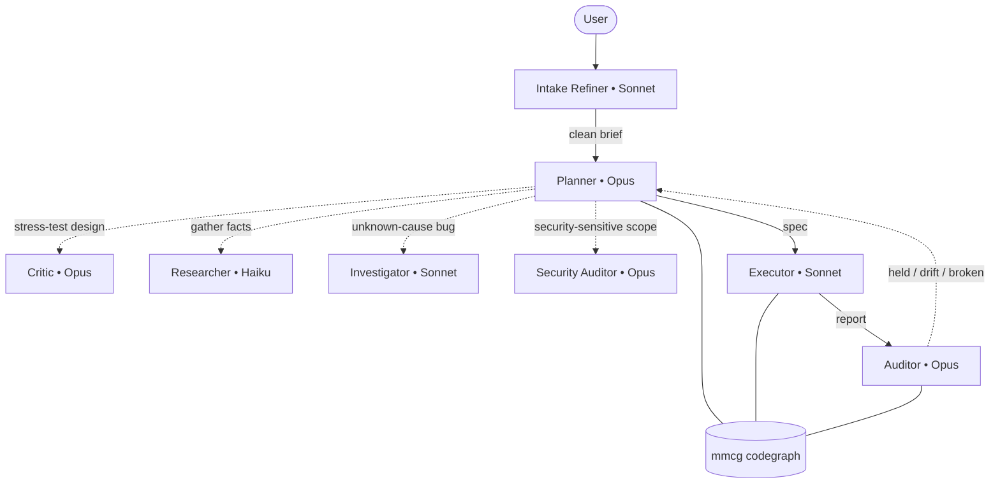

# Mastermind

<p align="center">
  
</p>

<p align="center">
  <a href="https://www.npmjs.com/package/@xcraftmind/mastermind"></a>
  <a href="https://github.com/xcrft/mastermind/actions/workflows/ci-mmcg.yml"></a>
  <a href="LICENSE"></a>
  <a href="evals/benchmarks.md"></a>
</p>

**Mastermind makes coding agents check their claims against your real code, not their memory.**

It's two parts:

1. **mmcg — a local codegraph.** A fast Rust indexer turns your repo into a queryable graph of symbols, calls, and imports, served to the agent over MCP. *Does `parseConfig` exist? Who calls it? What breaks if I change it?* — answered from the index, not a guess.
2. **A spec-driven agent workflow** built on it. The planner writes a spec, the executor implements it, and deterministic gates verify every claim before and after — so no hallucinated functions and no silent scope creep reach your branch.

## Quick start

Requires Node.js 24+. No Rust toolchain.

```bash
npm install -g @xcraftmind/mastermind

cd your-project
mastermind init                        # build the index, scaffold .mastermind/, draft CONTEXT.md
mastermind setup claude --write-mcp    # register the MCP server once, globally
mastermind doctor                      # verify — should be all green
```

Restart Claude Code and ask "who calls `parseConfig`?" — the answer comes from the codegraph.

[Other install methods ↓](#install)

## mmcg — the codegraph

A Rust binary that tree-sitter-parses **nine languages** (Python, TypeScript/TSX, JavaScript/JSX, Rust, C#, Go, Java, PHP, C/C++) into a local SQLite database and answers structural questions over MCP — **20 read-only tools**:

| Ask | Tool |
|---|---|
| Does symbol X exist? | `mmcg_search` |
| What calls X? | `mmcg_callers` |
| Blast radius of changing X? | `mmcg_impact` |
| What imports this path? | `mmcg_imported_by` |
| What did this branch add vs main? | `mmcg_symbols_changed_since` |
| Dependency cycles? Dead code? | `mmcg_dependency_cycles` · `mmcg_unreferenced` |

All 20: `mmcg_search` · `mmcg_callers` · `mmcg_callees` · `mmcg_impact` · `mmcg_imports` · `mmcg_imported_by` · `mmcg_symbols_in_file` · `mmcg_outline` · `mmcg_files` · `mmcg_api_surface` · `mmcg_unreferenced` · `mmcg_dependency_cycles` · `mmcg_symbols_changed_since` · `mmcg_centrality` · `mmcg_change_class` · `mmcg_recent_changes` · `mmcg_tasks` · `mmcg_status` · `mmcg_scratchpad_append` · `mmcg_scratchpad_read`. Precision notes: [`mcp/servers/mmcg/README.md`](mcp/servers/mmcg/README.md). Works with any MCP stdio client (Cursor, Continue, custom), not just Claude Code.

It's intentionally narrow — a syntactic graph, read-only, no daemon, zero system dependencies. Point queries are sub-millisecond; whole-graph aggregations (centrality, impact, cycles) scale with repo size. Faster and more precise than grep for "who calls what," and unlike an LSP it's trivial to snapshot and query from an agent.

## The workflow

A pipeline where **the planner never implements and the executor never improvises:**



The critic (before the spec) and auditor (after execution) run as independent Opus instances with no prior context — they catch the planner's own bias.

### The gates make it deterministic

Every spec is checked by Rust gates that read the mmcg index directly — a verdict can't be argued out of them:

- **`verify-spec`** (pre-execution) — every symbol in the spec exists, every file is on disk, mandatory sections are filled, FIND blocks aren't stale.
- **`audit-spec`** (post-execution) — no scope creep, no signature drift vs the pre-edit snapshot, no silently removed symbols, planned tests actually added.

The subagents query mmcg too, but that's an LLM *interpreting* results — useful, not a guarantee. **Trust the gates for correctness; trust the subagents' mmcg use for speed and reach.**

### Example: catching a hallucinated function

The executor reported:

```
[x] Added CancelOrder() to pkg/checkout/checkout.go
[x] Wired it to the existing ProcessPayment() for the refund flow
VERIFY: go test ./pkg/checkout/... — PASSED
```

The auditor ran `mmcg_search ProcessPayment` against the live index → `{ "count": 0 }`. `ProcessPayment` never existed; the executor invented a call site to it. Verdict: **contract broken** — caught by the graph, not by re-reading code.

## What's inside

```
Core
  mcp/servers/mmcg/     the mmcg codegraph binary — 20 MCP tools, 9 languages

Workflow (installed into ~/.claude/ by `mastermind init`)
  agents/subagents/     prompt-refiner · critic · researcher · investigator
                        task-executor · auditor · security-auditor
  agents/claude-md/     CLAUDE.md + CONTEXT.md templates
  skills/workflow/      task-planning · task-executor · codegraph-research
                        structured-report-contract · critical-review
  skills/debugging/     investigation-ledger
  skills/security/      agent-security-review (OWASP ASI reference pack)
  skills/prompt-engineering/  prompt-refiner (intake gate)

Proof
  evals/                adversarial eval suite — auditor + critic, real git fixtures
```

Shared contracts — codegraph queries, the executor↔auditor report format, the investigation loop — live in skills so every agent reads one source. Non-core artifacts (pr-review, flaky-finder, doc-stub-sync, …) live in [`extras/`](extras/), not installed by default. The naming + frontmatter standard is [`docs/conventions.md`](docs/conventions.md).

## Install

Ships as a **prebuilt native binary via npm** — no Rust toolchain.

**Global** (recommended)
```bash
npm install -g @xcraftmind/mastermind
mastermind setup claude --write-mcp
```
Registers `command: "mastermind"` at Claude Code user scope (writes `~/.claude.json`).

**Project-local** (version-pinned)
```bash
npm install -D @xcraftmind/mastermind
npx mastermind setup claude --project . --write-mcp
```
Writes `./.mcp.json` pointing at `./node_modules/.bin/mastermind`.

**Supported platforms:** macOS (arm64/x86_64), Linux glibc & musl/Alpine (x86_64/arm64), Windows (x86_64). Other targets: `cargo install mmcg`.

<details>
<summary>Build from source (Rust 1.75+)</summary>

```bash
cargo install mmcg                       # from crates.io
cargo install --path mcp/servers/mmcg    # from a clone
```
Same binary, `mmcg`, same subcommands.
</details>

## Commands

```bash
mastermind init                  # scaffold .mastermind/, build the index, draft CONTEXT.md
mastermind watch                 # keep the index live as you edit
mastermind doctor                # fail-soft health checks (add --json for CI)
mastermind status / next         # task list + health · single next step
mastermind new-spec "..."        # create a task spec (--mode lite|standard|strict)
mastermind resume <task-id>      # paste-into-Claude prompt for the current phase
mastermind verify-spec <spec>    # pre-execution gate
mastermind audit-spec <spec>     # post-execution gate
mastermind uninstall --scope all # tear it down (dry-run unless --force)
```

**Stays local.** The SQLite index is built from your files by tree-sitter and never leaves your machine; the only thing `setup` writes outside your project is `~/.claude.json`. Fully offline: `mastermind init --no-claude --no-index --no-global`. Add `.mastermind/` to `.gitignore` — it's local working state.

## Contributing

Read [`docs/conventions.md`](docs/conventions.md) (the standard) and the `*-anatomy.md` for your artifact type, copy the matching `_template/`, and open a PR. Process in [`CONTRIBUTING.md`](CONTRIBUTING.md).

## License

MIT — see [`LICENSE`](LICENSE).
