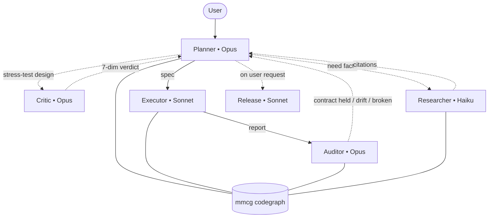

# Mastermind

<p align="center">
  
</p>

A curated standard library of **skills**, **prompts**, **agent configs**, and **MCP integrations** for AI coding agents (primarily [Claude Code](https://claude.com/claude-code), portable to other tools).

The goal is to give teams and individuals a place to find — and contribute — AI artifacts with a consistent shape, so adopting a new skill or prompt feels the same as the last one.

## Why mastermind

Most "AI workflow" templates are a planner prompt and good wishes. This repo ships a **spec-driven planner / critic / executor / auditor pipeline** grounded in a real codegraph (**mmcg**) — every claim a subagent makes about your code is verified against an AST, not hallucinated. Engineering canons (YAGNI, non-breaking, no AI slop, mandatory Tests / Docs / Observability / Performance sections in every spec) are checked by an independent Opus reviewer before a spec leaves the planner, and again by an independent Opus auditor after the executor reports.

## What's inside

| Folder | What it holds |
|---|---|
| [`skills/`](skills/) | Markdown skills with frontmatter. The workflow skills (`mastermind-task-planning`, `mastermind-task-executor`, `mastermind-incident-response`, `mastermind-prompt-refiner`) plus standalone ones (`pr-review`, `flaky-finder`, `doc-stub-sync`). |
| [`prompts/`](prompts/) | Reusable system/user prompt templates (`api-shape-explorer`). |
| [`agents/`](agents/) | 6 mastermind subagents (`critic`, `auditor`, `researcher`, `task-executor`, `release`, `prompt-refiner`), plus `CLAUDE.md` and `CONTEXT.md` templates. |
| [`mcp/`](mcp/) | MCP server configs. Headlined by **`mmcg`** — fast Rust codegraph indexer for Python/TS/JS/Rust with 14 structural query tools. |

Each top-level folder is grouped by **domain** inside (e.g. `skills/code-review/`, `agents/subagents/`). Every category ships a `_template/` you copy when adding something new.

## How it works

A task flows from the user through 4-7 specialized subagents — each at its own model tier — with **mmcg** (the codegraph MCP) as the shared truth source.



The **planner** never implements. The **executor** never improvises. The **critic** (pre-spec) and the **auditor** (post-execution) run as independent Opus instances with no prior conversation context — they catch the planner's bias.

Underneath every role sits **mmcg** — a Rust binary that indexes Python, TypeScript, JavaScript, Rust, C#, Go, Java, PHP, and C/C++ into a local SQLite codegraph and exposes 14 structural query tools over MCP (`search`, `callers`, `callees`, `impact`, `imports`, `imported_by`, `files`, `symbols_in_file`, `outline`, `recent_changes`, `unreferenced`, `api_surface`, `centrality`, `tasks`). Every subagent queries mmcg before claiming anything about the code: "does function X exist?", "who calls Y?", "transitive blast radius of changing Z?", "what past specs touched this area?". This is what makes the workflow's claims resistant to hallucination.

For the full 14-step flow (pre-flight validation, post-flight audit checks, parallel incident-response workflow, on-demand release packaging) see the [workflow CLAUDE.md template](agents/claude-md/mastermind-workflow.md).

## Engineering canons

Enforced by the critic (pre-spec) and the auditor (post-execution):

- **No AI slop** — every claim grounded in code via mmcg, not memory. Hallucinated symbols, fabricated SLAs, padded "best practices" sections, decorative output structures are flagged.
- **YAGNI** — no speculative features, no premature abstractions, no future-proofing for unstated requirements.
- **Non-breaking** — public-API changes require an explicit Non-breaking justification + deprecation path in the spec.
- **Mandatory spec sections** — every spec ships with Tests Plan, Documentation Plan, Observability Plan, Performance Considerations. Empty sections fail pre-flight.
- **Pre-edit symbol snapshot** — planner records current `mmcg_callers` count + signatures before editing; auditor compares post-execution to surface silent breakage.

See [`docs/conventions.md`](docs/conventions.md) for the full standard.

## Install

Mastermind is a **complete workflow grounded in a codegraph** — not just an MCP server. The default install brings everything: the `mmcg` binary, all subagents, skills, prompts, CLAUDE.md templates, MCP config.

### One-liner (recommended)

Installs the `mmcg` binary into `~/.cargo/bin/` and copies subagents / skills / prompts / templates into `~/.claude/`. Needs Rust 1.75+ ([rustup](https://rustup.rs/) if missing).

```bash
curl -fsSL https://raw.githubusercontent.com/xcrft/mastermind/main/install.sh | sh
```

Override the install location with `CLAUDE_HOME=/path/to/dir`. Re-run anytime to refresh — overwrites our artifacts but leaves your `mcp.json` alone (prints a snippet if it already exists). If `curl | sh` makes you nervous (fair), [read the script first](install.sh) — ~110 lines, no obfuscation.

### Or via Claude Code plugin marketplace

```bash
# In Claude Code:
/plugin marketplace add xcrft/mastermind
/plugin install mastermind-workflow@mastermind   # workflow subagents
/plugin install mmcg@mastermind                  # codegraph MCP config
/plugin install mastermind-tools@mastermind      # standalone skills (pr-review, flaky-finder, doc-stub-sync)
```

Plugins land in `~/.claude/plugins/`. The `mmcg` plugin registers the MCP server config; the binary is still a separate install — `cargo install --git https://github.com/xcrft/mastermind --path mcp/servers/mmcg`.

<details>
<summary>How the plugin tree is built</summary>

The `plugins/` tree is regenerated from canonical artifacts by [`scripts/build-plugins.py`](scripts/build-plugins.py). The `.claude-plugin/` manifests are the marketplace entry points.

</details>

---

## Bootstrap a project

Once mastermind is installed, in any project's working directory:

```bash
mmcg init                       # scaffolds .mastermind/{tasks/, .gitignore, mmcg.db}, CONTEXT.md
mmcg init --with-claude-md      # also drops in the workflow CLAUDE.md template
mmcg index .                    # populates the code index
mmcg watch &                    # (optional) keeps the index fresh as you edit
echo .mastermind/ >> .gitignore
```

`.mastermind/` holds the project's specs and the mmcg index — local working state, never committed. If you have a pre-0.6.0 `.tasks/` directory at project root, `mmcg init` will print a migration command.

---

## Subsets (advanced)

If the full workflow is more than you want, install only what you need.

### Just the codegraph

`mmcg` is a standalone [crate on crates.io](https://crates.io/crates/mmcg) — 14 structural query tools (search, callers, callees, impact, outline, recent_changes, unreferenced, api_surface, centrality, tasks, …) for Python / TypeScript / JavaScript / Rust / C# / Go / Java / PHP / C/C++. Zero system deps, sub-millisecond queries.

```bash
cargo install mmcg
```

Register it in your MCP client's config — snippet in [`mcp/servers/mmcg/README.md`](mcp/servers/mmcg/README.md#mcp-server-usage).

### Just specific subagents or skills

```bash
git clone https://github.com/xcrft/mastermind ~/mastermind
cp ~/mastermind/agents/subagents/mastermind-critic.md ~/.claude/agents/
cp -r ~/mastermind/skills/code-review/pr-review ~/.claude/skills/
```

Read each artifact's frontmatter (`name`, `description`, `metadata.requires`) to know what it expects. Note: pulling subagents in isolation skips the workflow contracts they normally operate under — the critic without the planner is still useful as a code reviewer, but the spec-driven pipeline guarantees only hold when the full set is in place.

---

## Not using Claude Code?

`mmcg` is tool-agnostic — works with any MCP stdio client (Cursor, Continue, custom). The subagent markdown files use Claude Code's frontmatter format, but the underlying patterns (planner/critic/executor/auditor pipeline, spec template, engineering canons) are portable — adopt them in whatever your tooling supports.

## Contributing

The repo lives or dies by consistency. Before adding anything, read:

- [`docs/conventions.md`](docs/conventions.md) — naming, frontmatter, file layout rules. **This is the standard.**
- The `anatomy.md` for your artifact type (e.g. [`docs/skill-anatomy.md`](docs/skill-anatomy.md)).
- [`CONTRIBUTING.md`](CONTRIBUTING.md) — PR process.

To add a new artifact: copy the matching `_template/`, fill it in, open a PR.

## License

MIT — see [`LICENSE`](LICENSE).
