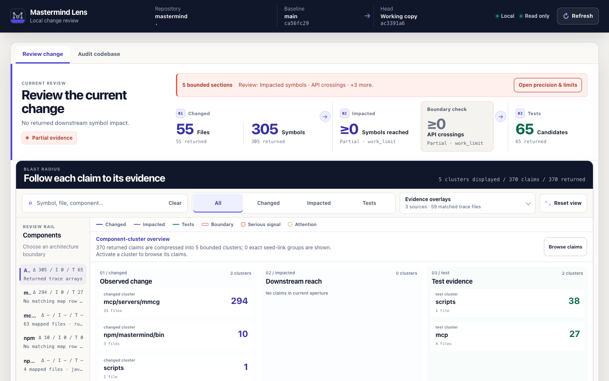

<p align="center">
  
</p>

<h1 align="center">Mastermind</h1>

<p align="center">Repository context and evidence-backed workflows for coding agents.</p>

<p align="center">
  <a href="https://www.npmjs.com/package/@xcraftmind/mastermind"></a>
  <a href="https://github.com/xcrft/mastermind/actions/workflows/ci-mmcg.yml"></a>
  <a href="LICENSE"></a>
</p>

Mastermind gives coding agents local code and documentation search, project
knowledge, optional personal preferences, and a controller that checks task
evidence before completion.

## Quick start

Requires Node.js 24+. The [npm manifest](npm/mastermind/package.json) lists
prebuilt binaries for macOS, Linux, and Windows. Run these commands inside your repository:

```bash
npm install -g @xcraftmind/mastermind
mastermind init
```

The first interactive run asks for a client and mining mode. It creates project
guidance, indexes code and documentation, and configures the selected client.
An unattended first run stays local unless you pass `--client`.

| Command | Result |
|---|---|
| `mastermind init` | Apply saved project choices from `.mastermind/setup.json` |
| `mastermind status --json` | Inspect the index, client configuration, session observations, and miner |
| `mastermind update` | Update the package in its existing npm scope and refresh installed workflows |
| `mastermind ui --since main` | Open the read-only Lens UI against your chosen Git baseline |

Restart the selected client to load its configuration. Registration, session
observations, and client trust are separate states. Keep `.mastermind/` working
data out of version control. See [Getting started](docs/getting-started.md) for
mining choices, Windows support, and other installation paths.

## What you can do

<a id="the-review-surface-your-diff-is-missing"></a>

| Need | Result |
|---|---|
| Review a change | Changed symbols, callers, boundaries, and candidate tests |
| Find context | Code search, cited Markdown, decisions, and task history |
| Apply working preferences | Reviewed habits selected by project, role, and workflow |
| Delegate a task | Approved scope, observed checks, audit, and semantic review |
| Share evidence | Lens, offline HTML, SARIF, and audit envelopes |
| Import analysis | SCIP, scanner reports, coverage, tests, traces, and facts |

<p align="center">
  
</p>

## Give an agent useful context

`init --client claude|codex|all` connects Claude Code, Codex, or both.
On first setup, a selected client defaults to local evidence capture.
Other clients use [MCP setup](docs/README.md#start-here).

| Context | Scope |
|---|---|
| Person | Advisory habits and preferences shared across repositories |
| Project | Repository decisions, constraints, and knowledge |
| Code and documentation | Indexed structure and cited source material |
| Role | Duties for this invocation |
| Workflow | Planning, execution, verification, and review |
| Task evidence | Results, blockers, and the reviewed revision |

Capture and personal-profile access are separate. `--profile-access on` opts
the selected project and clients into reading reviewed preferences. Those
preferences grant no action permissions. Context previews expose revisions
and omissions, not proof of model use. See [Architecture](docs/architecture.md)
and [Persona hooks](docs/guides/persona-hooks.md).

## Take a task through review

```bash
mastermind new-spec "Add account recovery"
```

Fill the goal, scope, acceptance criteria, and checks, then follow the
[Workflow guide](docs/workflow.md):

```text
criteria → implementation → checks → audit → review → complete or feedback
```

Any client can implement the spec. Recorded native execution and review use
Claude Code. Completion requires current evidence and resolved review.

## Limits

| Boundary | Meaning |
|---|---|
| Static codegraph | Dynamic dispatch, reflection, generated code, and cross-language calls may be incomplete |
| Personal profile | Reviewed preferences remain advisory |
| Task records | Local evidence does not independently establish correctness |
| Native process policy | Uses client restrictions, not an OS sandbox |
| Provider access | Indexing, deterministic queries, and Lens are local. Semantic mining, prompt refinement, drafting, execution, and review require explicit opt-in and can send content to a provider |
| Miner budgets | Repeated `init` preserves each run's counters, including stopped or exhausted runs. `miner start` explicitly starts a new run |
| Prompt refiner | Optional `--refiner on` uses additional calls outside the miner's call budget |

[Language coverage](docs/reference/mmcg.md#language-coverage) includes Python,
TypeScript/TSX, JavaScript/JSX, Vue SFC, Rust, C#, Go, Java, PHP, and C/C++.
Native hooks, managed mining, and supervised execution require macOS or Linux.
Windows can use local indexing and client setup with `--mining off`. See
[runtime support](docs/reference/task-runtime.md#process-supervision).

## Documentation

| Start | Reference |
|---|---|
| [Getting started](docs/getting-started.md) | [CLI and MCP](docs/reference/mmcg.md) |
| [Architecture](docs/architecture.md) | [Benchmarks](docs/benchmarks.md) |
| [Workflow](docs/workflow.md) | [Changelog](CHANGELOG.md) |
| [All guides](docs/README.md) | [Security policy](SECURITY.md) |

## Build and contribute

Source builds require Rust 1.96+, declared in
[Cargo.toml](mcp/servers/mmcg/Cargo.toml).

```bash
cargo install --path mcp/servers/mmcg --locked
just check
```

Cargo installs `mmcg`. npm exposes `mastermind` and `mmcg`.
See [Contributing](CONTRIBUTING.md), [GitHub Issues](https://github.com/xcrft/mastermind/issues),
and the [security reporting policy](SECURITY.md).

## License

[MIT](LICENSE).
