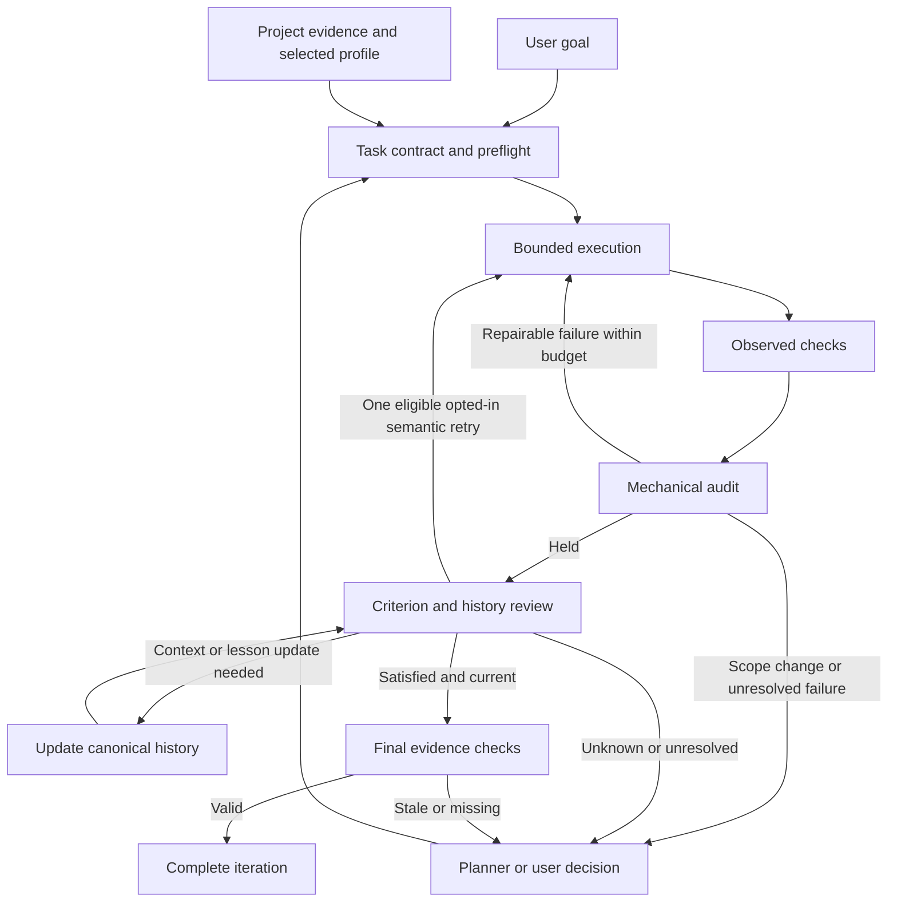

# How Mastermind works

Mastermind supplies project evidence, reviewed personal preferences and a task
controller. The AI client supplies the model and tool runtime.

## Vocabulary

| Term | Meaning |
|---|---|
| Person profile | Reviewed preferences and habits of the user, shared across projects |
| Habit | A reviewed pattern with evidence and an applicable role, task or workflow scope |
| Project context | Code, documentation, decisions and lessons belonging to one repository |
| Agent role | Duties and an allowed tool contract, such as executor or reviewer |
| Workflow | The order and conditions under which roles work |
| Task contract | The goal, scope, acceptance criteria and required checks |
| Evidence | A source, observed check result or review bound to specific inputs |
| Mining | Collection and analysis that proposes personal evidence and candidates |
| Indexing | Construction of a searchable view of current code or documents |
| Completion | A controller decision that this iteration meets its recorded contract |

Personal preferences guide behavior. They do not grant tool permissions,
change acceptance criteria or make project claims true.

## The task loop

| Event | Next action |
|---|---|
| Bound project inputs change | Refresh the affected checks, audit and reviews |
| An ignored lesson changes | Review the new history revision |
| Mechanical failure within the repair budget | Run the bounded repair path |
| Concrete negative criterion eligible for `--auto-follow-up` | One executor retry with fresh checks, audit and review under the same contract and iteration budget |
| Scope change or unresolved semantic judgment | Return a bound follow-up to the planner or user |

Native execution and review use the supported Claude CLI contract. Other clients
use MCP and the file-based workflow. See [setup](getting-started.md) and
[workflow](workflow.md).

## Storage and context

| Data | Source of truth | Delivered to the client |
|---|---|---|
| Code and documentation | Repository files and Git history | Search results, graph relations and cited sections in `.mastermind/mmcg.db` |
| Project decisions | `CONTEXT.md` and source evidence | Project profile and task-relevant context |
| Reusable lessons | `.mastermind/tasks/_lessons.md` | Reviewed, applicable project history |
| Task state | `.mastermind/tasks/<id>/` contracts, receipts and reviews | Status, blockers, next action and bounded task context |
| Human profile | Global `~/.mastermind/style.db` with evidence and review records | Applicable preferences through MCP/context and a readable `style.md` projection |
| Client integration | Installed instructions and explicit configuration | Role instructions, workflow entry points and enabled hooks |

| Mechanism | Responsibility |
|---|---|
| SQL | Evidence, revisions, review status and relations |
| Search and graph queries | Select the applicable records |
| Markdown | Canonical project decisions and readable profile exports |
| MCP | Expose bounded queries to an AI client |
| Context assembler | Combine checked layers and report missing, stale or omitted data |
| Vector retrieval, if added | Find candidates by similarity, then apply the same source, scope and review checks |

Context preview reads independently checked layers. It does not re-index files,
activate candidates or create one atomic snapshot across all stores.
See the [context contract](reference/persona-context.md).

## Hooks and personal evidence

| Stage | Stored result | Boundary |
|---|---|---|
| Native capture | Original events, identities, gaps and recorded profile/refiner influence | A user channel does not prove human authorship |
| Refiner | Original-bound intake, typed route and revision | An advisory is not execution or new permission |
| Task binding | Current session/intake/spec relation with compare-and-swap | Stale or conflicting revisions cannot replace the current relation |
| Managed mining | Bounded worker attempts and durable checkpoints | Collection and extraction do not activate habits |
| Candidate review | Decision on exact evidence | Dependent observations cannot increase independent support |
| Context delivery | Selected sources, audience grant and offered byte digests | Model use and benefit remain unknown |

Readiness reports registration, capture, observed sessions, refiner and worker
separately. Lens displays layer coverage, private review metadata and recorded
delivery without a personality completeness score. See [persona hooks](guides/persona-hooks.md).

## What completion establishes

| Gate for a structured task | Required evidence | Completion blocked by |
|---|---|---|
| Admission | Current task contract and required invocation binding | Denied or stale invocation |
| Verification | Current successful receipts for every required check | Missing, failed or stale receipt |
| Mechanical audit | Held audit bound to the work | Drift or Broken verdict |
| Acceptance | Satisfied review for every criterion and its required proof | Unknown, unsatisfied or stale judgment |
| Project history | Resolved decisions for current Context/Lesson bytes | Required update or unresolved review |
| Publication | Revalidation through the shared completion gate | Any invalidated obligation |

Resume, native auto-review and repeated postflight use that gate before
publishing `learned`. A completed iteration is historical. An explicit re-audit
evaluates the current work.

Legacy report-only tasks retain their weaker compatibility contract. Use
structured acceptance and observed `verify.run` checks for the full recorded
proof chain. Schemas are in the [reference](reference/mmcg.md).

## Boundaries and evaluation

| Boundary | Implemented control | Remaining gap |
|---|---|---|
| Tool effects | Admission, optional guarded native calls and postflight scope checks | Command-hook failure can fall back to client permissions. No OS sandbox |
| Verification freshness | Repository inputs and top-level executable binding | External dependencies and network responses are not fully captured |
| Semantic acceptance | Revision-bound criterion judgments | Judgment truth and reviewer independence need outcome evaluation |
| Completion | Finite guard model and selected real CLI regressions | Full Rust refinement and concurrent-transition proof remain open |

The [control-loop evaluation](../evals/control-loop.md) defines the theorem and
assumptions. The [scorecard](../evals/scorecard.md) records measured control,
indexing and model results, with unmeasured outcomes marked explicitly.
