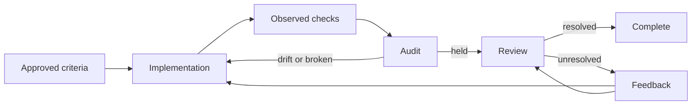

# Workflow

The controller checks current task evidence and review decisions before completion.



Feedback may require inspection or a project-history update. Scope changes need
a new approved contract.

## Choose a mode

| Mode | Use for | Required process |
|---|---|---|
| Direct | Small reversible changes | Implementation and repository-required checks |
| Verified | Explicit contract or delegated execution | Spec, preflight, checks, audit, review |
| Strict | High impact or difficult rollback | Verified plus risk, alternatives, rollback, and independent review |

New specs use `verified` or `strict`. Legacy `lite` and `standard` remain readable.

## Direct

```bash
mastermind index .
mastermind impact --since main
```

Implement, run relevant checks, and review the diff. Direct work creates no
controller state.

## Verified

### 1. Define and approve the task

```bash
mastermind new-spec "Add account recovery"
```

Use the printed path. Examples below use:

```bash
TASK_SPEC=.mastermind/tasks/001-add-account-recovery/spec.md
```

| Spec input | Required content |
|---|---|
| Goal | Observable requested behavior |
| Scope | Allowed files and symbols |
| Acceptance | Criteria mapped to checks |
| Verification | Commands and expected outcomes |
| Product/design context | Sources the reviewer can inspect |

#### Acceptance requirements

```yaml
verify:
  - cmd: python3 -m unittest discover -s tests
    run:
      id: unit
      argv: [python3, -m, unittest, discover, -s, tests]
      cwd: .
      timeout_secs: 300
acceptance:
  - id: expired-token
    statement: An expired recovery token is rejected without changing the account.
    checks: [unit]
```

Replace this example with the project's checks. Every mapped check is required.
The reviewer assesses whether the assertions actually support each criterion.

```bash
mastermind verify-spec "$TASK_SPEC"
mastermind run-task "$TASK_SPEC" --pre-only
```

Preflight binds the spec, baseline, and iteration. Contract edits require
approval and another preflight. Retries keep the original baseline.

### 2. Implement and record checks

Give the approved spec to an implementation client. The executor writes
`executor-report.md` with changed files, observed results, defects, and gaps.
For UI work, include browser observations or the reason they were not collected.

#### Observed verification commands (opt-in)

```bash
mastermind verification run "$TASK_SPEC" --id=unit --json
mastermind acceptance status "$TASK_SPEC" --json
```

| Contract | Behavior |
|---|---|
| `verify[].run` | Runner executes the declared argv and writes a receipt |
| Legacy `verify[].cmd` without `run` | Reported result only |
| Fresh successful receipt | Bound to task, files, Git state, and executable |
| Missing, pending, failed, or stale receipt | Blocks the requirement |
| Repeated run | Replaces the receipt and may invalidate unfinished review |

The report must agree with observed results. Argument arrays do not imply a shell.

| Runner limit | Value |
|---|---:|
| Checks per spec | 32 |
| Timeout per check | 1–3,600 seconds |
| Captured output | 1 MiB per stream |

Source: [runner contract](reference/task-runtime.md#observed-verification).
Execution requires macOS or Linux and retains normal filesystem/network permissions.

### 3. Audit the implementation

```bash
mastermind run-task "$TASK_SPEC" --post-only
```

Postflight compares the contract, report, receipts, and actual diff, including
staged, unstaged, and untracked work. Inspection does not launch checks.

| Result | Next action |
|---|---|
| Held / `history_review_required` | Review the result and project knowledge |
| Drift | Resolve the scope difference |
| Broken | Repair missing or inconsistent evidence, then re-audit |

<a id="semantic-history-review"></a>
<a id="review-the-task-result"></a>

## Review and complete

### Prepare an assessment

```bash
mastermind review-task prepare "$TASK_SPEC" --json
```

A human or LLM reviewer fills the returned `draft` after inspecting evidence.

| Assessment | Review question |
|---|---|
| Each criterion | Does the implementation satisfy the statement? |
| Verification quality | Do the assertions support the behavior? |
| Scope control | Are changes within the approved contract? |
| Proportionality | Is the solution appropriate for this task? |

Use concrete reasons and evidence references. Leave unsupported judgments
unknown. Save the completed draft as repository-contained JSON:

```bash
mastermind review-task submit "$TASK_SPEC" \
  --report .mastermind/tasks/001-add-account-recovery/review-input.json --json
mastermind review-task status "$TASK_SPEC" --json
```

These commands do not call a model. Submission checks the target and previous
review revision. A new negative or unknown assessment replaces prior approval.

### Resolve project knowledge

Review `CONTEXT.md` and `.mastermind/tasks/_lessons.md` separately.

| Decision | Meaning | Completion |
|---|---|---|
| `no_change` | Current file needs no further update | Eligible |
| `update_required` | Record a durable decision or lesson | Blocked |
| `unknown` | More inspection needed | Blocked |

Both decisions must be `no_change` and cite their own `knowledge:context` or
`knowledge:lessons` reference. An already adequate update qualifies.

| Change after review | Required follow-up |
|---|---|
| Either canonical knowledge file | Fresh review |
| Tracked inputs or check executable | Fresh checks and audit |
| Only ignored `_lessons.md` | Fresh review without automatically rerunning checks |

Standalone submit or native review can return exit 0 with `status: accepted`
and unresolved `history_status`. That record does not complete the task.

### Close the reviewed task

```bash
mastermind run-task "$TASK_SPEC"
```

The controller rechecks receipts, executables, audit, and review before
`learned`. Resume, auto-review, and repeated postflight share this gate.

| Contract | Completion evidence |
|---|---|
| Structured task | Current typed assessment and resolved history decisions |
| Legacy task | Bound **Audit snapshot**, Context/Lesson marked `updated` or `not applicable`, concrete reason |

`history-review.md` cannot override a structured assessment. `learned` records
the reviewed iteration, not deployment or future correctness.
Use `--post-only` to audit current work again.

<a id="continue-from-review-feedback"></a>

## Continue from feedback

```bash
mastermind review-task follow-up "$TASK_SPEC" --json
```

The read-only packet contains the active review, source revisions, and next action.
`next` and `resume` route unresolved pinned reviews here.

| First unresolved item | Action | Owner |
|---|---|---|
| Unsatisfied assessment | `revise_solution` | Planner |
| Unknown assessment | `inspect_review` | Reviewer |
| Required knowledge update | `update_project_history` | Planner |
| Unknown knowledge decision | `inspect_project_history` | Reviewer |
| All resolved | `complete` | Controller |

Continuation commands are conditional. Changed check inputs need verification,
changed audit inputs need postflight, and new knowledge or inspection needs
review. Stale or unavailable evidence produces no actionable packet.
Review reasons grant no permission to expand scope.

## Recorded native execution

`--exec` invokes Claude Code. Other clients use handoff and postflight.

```bash
mastermind run-task "$TASK_SPEC" --exec \
  --exec-timeout 1800 --exec-max-turns 40
```

| Property | Executor behavior |
|---|---|
| Iteration | New preflight with the original baseline |
| Context | Task-bound packet offered on stdin |
| Personal profile | Only through an existing `--profile-client` grant |
| Record | `invocation.json` stores hashes and outcomes, no raw prompt |
| Permissions | Native edit mode, no permission prompts or blanket Bash grant |
| Native configuration | Authentication, MCP, hooks, and local rules inherited |

Unsupported or denied native runs block postflight. `offered_to_process`
records input delivery and byte counts. `model_use` remains `unknown`, including
in Lens. File scope is audited after execution. Native policies are not an OS sandbox.

For an explicitly scoped task with observed checks:

```bash
mastermind run-task "$TASK_SPEC" --exec --guarded-exec --auto-review
```

Guarded mode checks supported tool calls against exact paths and verification
commands, then reconciles the decision log before accepting the invocation.
Native hook failures can fall back to client permissions. This mode records
conditional mediation, not OS containment. See [rules and limits](reference/task-runtime.md#guarded-execution).

<a id="run-a-native-semantic-reviewer"></a>

### Native review

```bash
mastermind review-task run "$TASK_SPEC" --timeout 600 --max-turns 20 --json
```

The reviewer requests `Read,Grep,Glob`, no permission prompts, empty MCP, and
supported native restrictions. It injects no personal profile.
`review-invocation.json` records the attempt separately.

```bash
mastermind run-task "$TASK_SPEC" --exec --auto-review
mastermind run-task "$TASK_SPEC" --auto-review
```

| Mode | Runs | Completion |
|---|---|---|
| `review-task run` | Reviewer only | Stores assessment |
| `--exec --auto-review` | Executor, audit, then one reviewer | Closes if all gates pass |
| `--auto-review` without `--exec` | One reviewer for an existing held task | Preserves baseline, iteration, options, and executor receipt |
| `--exec --auto-review --auto-follow-up` | At most one eligible semantic repair and a fresh review | Uses the same cumulative iteration budget |

Review resume runs no executor or checks. It rejects missing, unheld, completed,
or mechanically stale tasks, and conflicts with `--reset` and `--force-iteration`.
Without `--auto-follow-up`, a negative review stops. Unknown judgments,
unresolved history and native failures stop even when that flag is enabled.

| Native limit | Executor | Reviewer |
|---|---:|---:|
| Default process time | 1,800 s | 600 s |
| Allowed process time | 1–7,200 s | 1–7,200 s |
| Default turns | 40 | 20 |
| Allowed turns | 1–100 | 1–100 |

Sources: [CLI definitions](../mcp/servers/mmcg/src/main.rs) and
[runtime contract](reference/task-runtime.md). Preparation has separate bounds.

### Bounded automatic repair

```bash
mastermind run-task "$TASK_SPEC" --exec --auto-repair --max-iterations 3 --auto-review
# Also allow one qualifying semantic follow-up after mechanically passing checks:
mastermind run-task "$TASK_SPEC" --exec --auto-review --auto-follow-up --max-iterations 3
```

| Condition | Action |
|---|---|
| Fresh ordinary check failure, honest partial report, implementation defect, approved scope | Retry within the iteration budget |
| Missing/stale evidence, infrastructure failure, scope drift, runtime denial/failure, changed executable | Stop |
| Current native review with a concrete unmet criterion, no unknown criteria, other judgments satisfied and both history decisions `no_change` | One semantic retry only with `--auto-follow-up`, then fresh checks, audit and review |
| Unknown judgment, unresolved history, scope/permission issue, stale source | Stop without another repair |

Semantic feedback retains review, input and executable revisions. It treats the
reviewer's explanation as an unverified claim and never invents a failed check.
`--auto-follow-up` requires `--exec --auto-review` and a 1–20 iteration limit.
It cannot use `--force-iteration`, `--pre-only` or `--post-only`.

Both retry modes require structured acceptance and observed checks. Their
cumulative budget includes prior preflights and is limited to 1–20 iterations.
A second negative review stops. See [exact retry gates](reference/task-runtime.md#one-semantic-follow-up).

## Strict

```bash
mastermind new-spec "Rotate signing keys" --mode strict
```

Add alternatives, threat/failure cases, rollback or migration, and independent
review. Security review covers auth, secrets, permissions, delegation, and
supply-chain changes. `mode: strict` enables strict preflight checks.

## Task artifacts and ownership

| Artifact | Writer | Purpose |
|---|---|---|
| `spec.md` | Planner | Goal, scope, criteria, checks, risk |
| `executor-report.md` | Executor | Observations and gaps |
| `verification/*.json` | Runner | Latest check results |
| `audit.md`, `state.json` | Controller | Mechanical findings and lifecycle |
| `invocation.json` | Executor runner | Execution record |
| `review-invocation.json` | Reviewer runner | Review execution record |
| `semantic-review.json` | Review command | Judgments and active revision |
| `history-review.md` | Controller, planner for legacy tasks | History pointer or legacy decisions |

Project knowledge belongs in CONTEXT and reviewed lessons. Personal habits
belong in the global [profile](guides/persona-hooks.md).

## When progress stops

| Problem | Action |
|---|---|
| Index missing or stale | `mastermind index .`, then `mastermind status` |
| Spec changed | Approve the revision and repeat preflight |
| Check missing, failed, or stale | Run it for final inputs, then postflight |
| Review target changed | Prepare a fresh assessment |
| Knowledge update required | Write useful knowledge, then review |
| Native failure | Inspect the receipt reason and correct the blocker |
| Controller busy | Wait for that task's active controller |
| Evidence malformed or unavailable | Restore or regenerate it |

Records are local, unsigned, and owner-writable. They do not independently
verify identity or semantic correctness.

## Deterministic workflow audit

```bash
mastermind workflow audit --root .
mastermind doctor --workflow --client all
```

These check installation and wiring without running agents.
See [workflow audit](reference/mmcg.md#workflow-audit) for diagnostics.

## Related documentation

- [Architecture](architecture.md)
- [CLI and MCP reference](reference/mmcg.md)
- [Client integrations](README.md#start-here)
- [GitHub Action](github-action.md)
