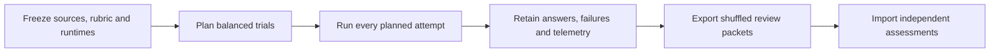

# Research benchmark

Prepare matched sources, run a pinned model adapter, retain complete answers
and export them for [offline review](REVIEW.md).



| Validation layer | Current status |
|---|---|
| Built-in Claude adapter | Covered by deterministic fixture tests |
| Live-model compatibility | Requires a fresh run |
| Representative quality baseline | Unmeasured |
| Comparison acceptance | `comparability.eligible: false`, `comparison_accepted: false` |
| Causal quality change | `quality_uplift: null`, importing reviews does not change it |

## Conditions and corpus

| Condition | Instructions | Tools |
|---|---|---|
| `source` | Common research instruction | Read, search and Git inspection |
| `portable` | Common instruction plus pinned research skill | Same source tools |
| `portable_mmcg` | Same instructions as `portable` | Same source tools plus mmcg |

Every condition uses the same public task, source bytes, hidden rubric, model
and budgets. Preparation creates independent repositories from an explicit Git
file allowlist. Original history, configuration, omitted files and answer keys
are excluded. Each trial records common, condition and request hashes.

### Calibration corpus

[corpus.json](corpus.json) binds each public task to its private review key and
indexed source files.

| Case | Focus |
|---|---|
| `task-phase-continuity-01` | Workflow history and persistence |
| `document-evidence-boundaries-01` | Document freshness and evidence limits |
| `callees-definition-boundaries-01` | Ambiguous definitions and outgoing calls |
| `reference-removal-evidence-01` | References needed before code removal |

These are published, source-reviewed calibration examples. Held-out quality and
representativeness remain unmeasured.

```sh
python3 -m evals.benchmark_corpus --source-repo /absolute/path/to/mastermind
```

This checks task/key identity, pinned Git objects, source hashes, scope and
anchor ranges without model calls. It does not verify the meaning of a claim.
The pinned history must be available locally. The checker never fetches it.

## Prepare an experiment

Requires Python 3.10+, Git and a POSIX host with `waitid` and `WNOWAIT`. Use an
output directory outside the source repository and trusted, already installed
adapter and mmcg executables. The harness does not build, download or select an
alternative binary.

Process supervision keeps the leader's PID reserved until group cleanup. On
macOS, `/bin/ps` distinguishes a completed group from a live group when
`killpg` reports `EPERM`; a live group's cleanup failure remains an error.

Create a local configuration with actual identities:

```json
{
  "model": "exact-model-id",
  "tool_revision": "full-tool-commit-id",
  "instruction_path": "skills/workflow/mastermind-codegraph-research/SKILL.md",
  "adapter": {
    "path": "/absolute/path/to/adapter",
    "sha256": "executable-sha256",
    "version": "exact-version",
    "origin": "runtime-source"
  },
  "mmcg": {
    "path": "/absolute/path/to/mmcg",
    "sha256": "executable-sha256",
    "version": "exact-version",
    "source_revision": "same-full-tool-commit-id",
    "origin": "runtime-source",
    "index_contract": {
      "schema_version": "8",
      "extractor_contract_version": "mmcg-extractors-v6",
      "concept_normalization_version": "mmcg-concepts-v2"
    }
  },
  "limits": {
    "timeout_seconds": 300,
    "trace_bytes": 2097152,
    "stderr_bytes": 65536,
    "answer_bytes": 65536,
    "max_turns": 8,
    "max_output_tokens": 4096
  }
}
```

Match index-contract fields to the pinned runtime. The task's source revision
and the evaluated tool/instruction revision serve different purposes and are
recorded separately.

```sh
python3 evals/benchmark.py prepare \
  --case document-evidence-boundaries-01 \
  --config /absolute/path/to/config.json \
  --source-repo /absolute/path/to/mastermind \
  --tool-repo /absolute/path/to/mastermind \
  --output /absolute/path/to/experiment
```

| Preparation setting | Contract |
|---|---|
| Default plan | 3 conditions × 3 repetitions = 9 attempts, rotating condition order |
| `--repetitions` | Change the repetition count |
| `--corpus` | Select another registry |
| `--task PATH --rubric PATH` | Custom task instead of `--case` |
| Rubric binding | Must match task ID and source revision |
| Custom task status | Does not inherit calibration-corpus source review |

Corpus cases supply the exact indexed subset. A conflicting `mmcg.indexed_files`
setting fails. For custom tasks, provide that subset when some source files are
not indexed. Only `portable_mmcg` runs the indexer. A wrong, partial or stale
SQLite index remains a setup failure, including wrong root/contracts/file
hashes or nonempty WAL/journal state.

Preparation does not call a model. It rejects source/instruction path overlap
for corpus cases, unsupported file types, unsafe paths and leaked answer keys.
Path checks do not detect copied instructions or all corpus contamination.

## Run every planned attempt

```sh
python3 evals/benchmark.py run /absolute/path/to/batch-id/trial-id
```

Follow `batch.json` order. A batch lock serializes attempts and requires the
previous result before the next begins. Each attempt has a one-shot lock. A
crash leaves it unfinished. Prepare a new balanced batch when changing runtime
or experiment settings. Do not selectively retry failed conditions.

A trial gets a private HOME, XDG and temporary directory. Credentials are passed
only by explicit `--credential-env NAME`. Supported names are `OPENAI_API_KEY`,
`ANTHROPIC_API_KEY` and `CLAUDE_CODE_OAUTH_TOKEN`. They are not written into the
request. All other inherited environment variables are cleared.

Files and runtime identities are rechecked. Results link to the batch plan and
previous result. One-shot publication rejects replaced files and directories.
A missing or corrupt chain prevents verified execution-order claims.

## Generic adapter contract

The pinned executable receives no arguments. Its cwd is the source projection.
Stdin is one `mastermind-research-adapter-v1` JSON request followed by a newline.
The request contains the public task, frozen source identities, instructions,
model, limits and available tools. It omits the rubric and other trial results.

stdout must contain one `init`, optional `trace` events and one terminal `result`:

```jsonl
{"type":"init","model":"exact-model-id","adapter_version":"exact-version"}
{"type":"trace","tool":"source_read","path":"src/service.py","start_line":1}
{"type":"result","answer":"Observed behavior at src/service.py:2.","model_error":false,"turns":1,"usage":{"input_tokens":25,"output_tokens":12,"cache_read_tokens":0,"cache_write_tokens":0},"cost_usd":0}
```

A successful answer is nonempty and fits the configured cap. Token counts must
be nonnegative integers and turn count positive. Missing cost is unknown.
Observed model and adapter identity must match the manifest. Non-JSON stdout,
incomplete telemetry or malformed event order fails the protocol.

The adapter must preserve the supplied instructions, expose only declared tools,
disable unrelated hooks/settings/history and enforce model/turn/output budgets.
Embedded skill references are not automatically resolved. The supervisor bounds
wall time and output bytes and cleans up its process group. These are controls
over a trusted executable, not an OS sandbox.

## Built-in Claude adapter

Use this `adapter` configuration with an explicitly pinned CLI:

```json
{
  "kind": "claude_cli",
  "cli": {
    "path": "/absolute/path/to/claude",
    "sha256": "executable-sha256",
    "version": "2.1.236",
    "origin": "runtime-source"
  }
}
```

The fixture-tested contract targets the displayed version. Compatibility with
another CLI or live service requires a fresh run. Preparation pins a copied
Python adapter bundle, interpreter and CLI. It does not attest shared libraries.

```sh
python3 evals/benchmark.py run /absolute/path/to/batch-id/trial-id \
  --credential-env ANTHROPIC_API_KEY
```

This adapter requires an API key and does not use OAuth/keychain fallback.
The CLI runs in an empty client directory with explicit instructions, no general
built-in tools, no persisted session and one strict MCP configuration. Observed
inventory, permission mode, working directory, model and tool-result identities
must match. Managed host policies can still affect a run.

The broker exposes allowlisted UTF-8 source ranges, literal search and frozen
Git inspection. Only the third condition adds `mmcg_concept`, `mmcg_search`,
`mmcg_outline`, `mmcg_files`, `mmcg_callers` and `mmcg_callees`. Root, index and
command configuration cannot be changed through tool arguments. Native ambiguity,
freshness errors and truncation are preserved. Credential variables are removed
from broker/server environments.

The CLI receives a turn limit and per-response output cap. A live usage cutoff
can overshoot the aggregate token budget. The final result records the violation.
Permission denials, model switches and cutoffs cannot become completed trials.
Raw bounded `claude-stream.jsonl` may include tool inputs/results and should be
handled as private experiment data.

## Interpret results

| Result | Meaning |
|---|---|
| `completed` | Transport, identity and required telemetry passed. An answer was retained |
| `setup_error`, `identity_mismatch`, `protocol_error`, `invocation_error` | Infrastructure or contract failed |
| `timeout`, `output_limit`, `budget_exceeded` | An execution bound was exceeded |
| `model_error` | The model invocation failed |
| `quality: review_pending` | A retained answer awaits a separate semantic assessment |

Keep setup time separate from investigation time and include every planned
attempt. A failed run may retain a partial answer. It remains failed. Missing
telemetry must not become zero cost. Full answer bytes, their hashes and logs
support [offline assessment](REVIEW.md). An intact transport record does not
establish a correct answer.

| Resource | Hard limit |
|---|---:|
| Trial wall time | 3,600 s |
| Trace or diagnostic stream | 16 MiB each |
| Turns | 64 |
| Declared output tokens | 65,536 |

Lower limits are part of experiment identity. Generic request versions 1 and 2
and batch-bound manifests retain their own schema guarantees. Legacy data cannot
claim the newer execution-chain checks.

## Test the harness

```sh
python3 -m unittest evals.test_benchmark evals.test_claude_adapter \
  evals.test_benchmark_corpus evals.test_benchmark_review
```

These checks exercise real disposable files/processes and fixture adapters.
They make no model calls and do not measure model quality.
