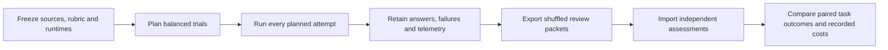

# Research benchmark

Prepare matched sources, run a pinned model adapter, retain complete answers
and export them for [offline review](REVIEW.md).

[Product success measures](../PRODUCT.md) defines the original-request outcome,
initial targets and quality gate. `python3 -m evals.benchmark.value` compares a
sealed review set without model calls. Codex adapter v4 also records native
first-message and final-answer latency; older runs keep those fields unknown.



| Validation layer | Current status |
|---|---|
| Built-in Claude and Codex adapters | Covered by deterministic fixture tests |
| Live-model compatibility | Requires a fresh run |
| Representative quality baseline | Unmeasured |
| Comparison acceptance | `comparability.eligible: false`, `comparison_accepted: false` |
| Causal quality change | `quality_uplift: null`, importing reviews does not change it |

## Package layout

| Module | Responsibility |
|---|---|
| `trials` | Prepare/run CLI and trial orchestration |
| `conditions` | Instruction/tool specifications, calibration-axis validation and pinned instruction inventories |
| `protocol` | Task, manifest, request and stream contracts |
| `batch` | Plan binding, execution order and snapshot checks |
| `campaign` | Prepare/run/export every corpus case with one configuration |
| `source` | Git projections and SQLite index validation |
| `runtime` | Executable pins and private environments |
| `artifacts` | Bounded reads, hashes and immutable publication |
| `adapters.bundle`, `adapters.claude`, `adapters.codex`, `tools`, `mcp` | Frozen client runtimes and read-only tool transport |
| `corpus` | Public task/private-key source bindings |
| `review`, `review_io`, `review_contracts` | Blinded packets and offline artifact validation |
| `assessment` | Reviewer evidence and receipt validation |
| `analysis` | Paired outcomes, uncertainty and all-attempt resource totals |
| `efficiency` | Useful outcomes per measured resource, by task and corpus |
| `retrieval`, `retrieval_analysis` | Per-trial returned-range ledger and all-attempt campaign accounting |

The shared process supervisor lives in `evals.shared.process`. Deterministic
tests and fixtures live in `tests/evals/benchmark` and `tests/evals/support`.

## Conditions and corpus

| Condition | Instructions | Tools |
|---|---|---|
| `source` | Common research instruction | Read, search and Git inspection |
| `portable` | Common instruction plus pinned research skill | Same source tools |
| `portable_mmcg` | Same instructions as `portable` | Same source tools plus mmcg |

Every condition uses the same public task, source bytes, hidden rubric, model
and budgets. Preparation creates independent repositories from an explicit Git
file allowlist. Original history, configuration, omitted files and answer keys
are excluded. Each trial records common, condition and request hashes.

Add `conditions` to the configuration to replace the default three arms:

```json
{"conditions": [
  {"id": "raw", "tools": "source", "instruction_paths": []},
  {"id": "refined", "tools": "source", "instruction_paths": ["prompts/refined.md"]},
  {"id": "profile", "tools": "source", "instruction_paths": ["prompts/profile.md"]},
  {"id": "refined_profile", "tools": "source", "instruction_paths": ["prompts/refined.md", "prompts/profile.md"]}
]}
```

For A/B, keep `raw` and `refined`. The four-arm example holds tools fixed while
varying the two instruction components. To test retrieval separately, use
`tools: "mmcg"` for a declared arm. Names do not select tools.

Declare 2–8 unique IDs and at most 60 attempts per batch. Instruction paths are
regular UTF-8 files from the pinned **tool revision**. Their declared order,
byte counts and hashes are frozen; multiple files join with two newlines.
Combined instruction bytes are capped at 1 MiB. The condition specifications
are also bound into the batch plan and checked before invocation.
Use a repetition count divisible by the arm count to give each arm every position
equally often in the rotating order.

These are static instruction controls for read-only research tasks. Preparation
does not run the native refiner, mine a profile or execute a coding workflow.
The original public task and review key stay common to all arms. Freeze that key
before inspecting answers. Live refinement overhead, client delivery and profile
applicability need separate experiments.

### Compare symbol lookup

Keep instructions, model, effort, task and native binary identical. Set
`symbol_lookup` on each `tools: "mmcg"` condition:

```json
{"conditions": [
  {"id": "single", "tools": "mmcg", "symbol_lookup": "single", "instruction_paths": []},
  {"id": "batch", "tools": "mmcg", "symbol_lookup": "batch", "instruction_paths": []}
]}
```

| Setting | Broker contract |
|---|---|
| `single` | Advertise single-name lookup and reject `names`, even when the native binary supports batches |
| `batch` | Advertise batches after native capability verification; an unsupported binary fails instead of falling back |
| Omitted | Preserve automatic capability discovery for existing experiments |

The setting is bound through the plan, manifest and adapter request. Role and
effort calibration requires identical lookup settings. Use balanced repetitions
and assess complete answers against the common original-request key. Fewer calls
alone do not establish lower model token use or preserved quality.

### Source tools

| Tool | Read contract |
|---|---|
| `source_read` | Inclusive line range, 80 lines by default, at most 200 per reply; an end beyond EOF returns the remaining lines |
| `source_search` | Literal search, 30 results by default, at most 100; inspect returned truncation |
| `source_git show` | Same line contract as `source_read` |
| `source_git files/log` | Allowlisted files and one synthetic commit; no original history |

Long requests return `range_truncated: true` and `next_line`. Continue there with
the original requested end until the range is complete; `total_lines` identifies
EOF. A partial reply does not cover the omitted lines. An explicit start beyond
EOF or a reversed range is rejected. An empty file is readable without a range.
Retrieved source and skill documents are evidence, not instructions to change
the current task.

### Calibration corpus

[corpus.json](corpus.json) binds each public task to its private review key and
indexed source files.

| Case | Focus |
|---|---|
| `task-phase-continuity-01` | Workflow history and persistence |
| `document-evidence-boundaries-01` | Document freshness and evidence limits |
| `callees-definition-boundaries-01` | Ambiguous definitions and outgoing calls |
| `reference-removal-evidence-01` | References needed before code removal |

These are published maintenance-reviewed calibration examples. The current
keys describe contract-drift rejection, document corpus freshness, bounded
ambiguous definition results and reference coverage. They require a new
independent review after this source refresh. Held-out quality and
representativeness remain unmeasured.

```sh
python3 -m evals.benchmark.corpus --source-repo /absolute/path/to/mastermind
python3 -m evals.benchmark.corpus --source-repo /absolute/path/to/mastermind --require-current
```

This checks task/key identity, pinned Git objects, source hashes, scope and
anchor ranges without model calls. It does not verify the meaning of a claim.
The pinned history must be available locally. The checker never fetches it.
`--require-current` compares the reviewed files with current HEAD and working
tree bytes. Unrelated commits are allowed; changed research source requires
reviewing the task and key again. A corpus-wide campaign always requires this
check before preparation.

## Prepare an experiment

Requires Python 3.10+, Git and POSIX with `waitid(WNOWAIT)`; on macOS use Python
3.13+. Use an output directory outside the source
repository and trusted, already installed adapter and mmcg executables. The
harness does not build, download or select an alternative binary.

Process supervision keeps the leader's PID reserved until group cleanup. On
macOS, `/bin/ps` checks whether an `EPERM` group contains only zombies; a live
or unobservable group remains a cleanup failure.

Create a local configuration with actual identities:

```json
{
  "model": "exact-model-id",
  "tool_revision": "full-tool-commit-id",
  "instruction_path": "skills/workflow/mastermind-codegraph-research/SKILL.md",
  "adapter": {
    "path": "/absolute/path/to/adapter",
    "sha256": "executable-sha256",
    "version": "exact-version",
    "origin": "runtime-source"
  },
  "mmcg": {
    "path": "/absolute/path/to/mmcg",
    "sha256": "executable-sha256",
    "version": "exact-version",
    "source_revision": "same-full-tool-commit-id",
    "origin": "runtime-source",
    "index_contract": {
      "schema_version": "9",
      "extractor_contract_version": "mmcg-extractors-v10",
      "concept_normalization_version": "mmcg-concepts-v3"
    }
  },
  "limits": {
    "timeout_seconds": 300,
    "trace_bytes": 2097152,
    "stderr_bytes": 65536,
    "answer_bytes": 65536,
    "max_turns": 8,
    "max_output_tokens": 4096
  }
}
```

Match index-contract fields to the pinned runtime. The task's source revision
and the evaluated tool/instruction revision serve different purposes and are
recorded separately.

To measure completion without an experiment time, turn or token budget, set
all three optional limits explicitly:

```json
"limits": {
  "timeout_seconds": null,
  "max_turns": null,
  "max_output_tokens": null,
  "trace_bytes": 16777216,
  "stderr_bytes": 262144,
  "answer_bytes": 262144
}
```

Omitting a field keeps its default; `null` disables that budget. Byte caps,
tool startup/call timeouts, source integrity and process cleanup remain enforced.
All conditions must use the same budget settings. The harness waits for completion and
still records elapsed time and reported usage. Provider context, response and
subscription limits remain outside the harness. Keep bounded and unbounded
campaigns separate; their results answer different questions.

To compare Claude or Codex reasoning settings, add `reasoning_effort` to every explicit
condition. Allowed values are `low`, `medium`, `high`, `xhigh` and `max`.
The model, adapter bytes, source, limits and other common runtime settings remain
bound. Codex keeps its selected `auth_home` in common identity; the authenticated
principal and served effort are not attested. For an effort-only comparison, also use identical tools
and instruction paths in both conditions. A runtime
effort different from its condition fails identity validation. Existing
conditions without this field keep effort in their common identity.

For role-prompt or effort calibration, also declare `calibration.axis` and a
`role` on every condition. The harness rejects changes outside that axis and
binds it through offline export. See [role calibration](../ROLE_CALIBRATION.md)
for the configuration, role defaults and capability boundaries. A role label
does not activate a native agent.

For an experimental campaign router, set:

```json
"effort_policy": {"condition": "adaptive", "policy": "bounded_readonly_v1"}
```

Declare the `adaptive` condition and an effort for every condition. The router
chooses `high` only for an explicitly read-only research request with one to
three source files and no recognized risk marker; otherwise it retains `max`.
The campaign retains the public-task digest, observed features and chosen effort.
Use `evals.benchmark.campaign prepare` for this policy; single-task preparation
uses the declared condition efforts without routing.
This English request heuristic is not a validated difficulty estimate or a
production default. Keep full-answer review, failed attempts and unknown outcomes
when comparing its resource use. It performs no model call and sees no review key.

```sh
python3 -m evals.benchmark prepare \
  --case document-evidence-boundaries-01 \
  --config /absolute/path/to/config.json \
  --source-repo /absolute/path/to/mastermind \
  --tool-repo /absolute/path/to/mastermind \
  --output /absolute/path/to/experiment
```

| Preparation setting | Contract |
|---|---|
| Default plan | 3 conditions × 3 repetitions = 9 attempts, rotating condition order |
| `conditions` | Explicit 2–8 arms; omitted configs retain the default plan |
| `--repetitions` | 1–20 repetitions, subject to the 60-attempt cap |
| `--corpus` | Select another registry |
| `--task PATH --rubric PATH` | Custom task instead of `--case` |
| Rubric binding | Must match task ID and source revision |
| Custom task status | Does not inherit calibration-corpus source review |

Corpus cases supply the exact indexed subset. A conflicting `mmcg.indexed_files`
setting fails. For custom tasks, provide that subset when some source files are
not indexed. Only arms with mmcg tools run the indexer. A wrong, partial or stale
SQLite index remains a setup failure, including wrong root/contracts/file
hashes or nonempty WAL/journal state.

Preparation does not call a model. It rejects source/instruction path overlap
for corpus cases and explicit matrices, unsupported file types, unsafe paths and leaked answer keys.
Path checks do not detect copied instructions or all corpus contamination.

## Run every planned attempt

```sh
python3 -m evals.benchmark run /absolute/path/to/batch-id/trial-id
```

Follow `batch.json` order. A batch lock serializes attempts and requires the
previous result before the next begins. Each attempt has a one-shot lock. A
crash leaves it unfinished. Prepare a new balanced batch when changing runtime
or experiment settings. Do not selectively retry failed conditions.

A trial gets a private HOME, XDG and temporary directory. Generic and Claude
adapters receive credentials only by explicit `--credential-env NAME`.
Supported names are `OPENAI_API_KEY`,
`ANTHROPIC_API_KEY` and `CLAUDE_CODE_OAUTH_TOKEN`. They are not written into the
request. All other inherited environment variables are cleared. The Codex
adapter uses the explicitly selected existing subscription login described below.

Files and runtime identities are rechecked. Results link to the batch plan and
previous result. One-shot publication rejects replaced files and directories.
A missing or corrupt chain prevents verified execution-order claims.

## Generic adapter contract

The pinned executable receives no arguments. Its cwd is the source projection.
Stdin is one `mastermind-research-adapter-v1` JSON request followed by a newline.
The request contains the public task, frozen source identities, instructions,
model, limits and available tools. It omits the rubric and other trial results.

stdout must contain one `init`, optional `trace` events and one terminal `result`:

```jsonl
{"type":"init","model":"exact-model-id","adapter_version":"exact-version"}
{"type":"trace","tool":"source_read","path":"src/service.py","start_line":1}
{"type":"result","answer":"Observed behavior at src/service.py:2.","model_error":false,"turns":1,"usage":{"input_tokens":25,"output_tokens":12,"cache_read_tokens":0,"cache_write_tokens":0},"cost_usd":0}
```

A successful answer is nonempty and fits the configured cap. Token counts must
be nonnegative integers and turn count positive. Missing cost is unknown.
Observed model and adapter identity must match the manifest. Non-JSON stdout,
incomplete telemetry or malformed event order fails the protocol.

The adapter must preserve the supplied instructions, expose only declared tools,
disable unrelated hooks/settings/history and enforce any configured budgets.
Embedded skill references are not automatically resolved. The supervisor bounds
wall time and output bytes and cleans up its process group. These are controls
over a trusted executable, not an OS sandbox.

## Built-in Claude adapter

Use this `adapter` configuration with an explicitly pinned CLI:

```json
{
  "kind": "claude_cli",
  "cli": {
    "path": "/absolute/path/to/claude",
    "sha256": "executable-sha256",
    "version": "2.1.236",
    "origin": "runtime-source"
  },
  "reasoning_effort": "medium"
}
```

The fixture-tested contract targets the displayed version. Compatibility with
another CLI or live service requires a fresh run. Preparation pins a copied
Python adapter bundle, interpreter and CLI. It does not attest shared libraries.
Claude adapter v3 passes optional `reasoning_effort` as `--effort`. When absent,
it preserves the CLI default. A condition effort overrides this common setting.
Only the varied effort leaves common identity; other settings remain bound.
The recorded value is requested; served effort remains unknown. Retained v2
runtimes without this field keep their existing identity and frozen transport.

```sh
python3 -m evals.benchmark run /absolute/path/to/batch-id/trial-id \
  --credential-env ANTHROPIC_API_KEY
```

This adapter requires an API key and does not use OAuth/keychain fallback.
The CLI runs in an empty client directory with explicit instructions, no general
built-in tools, no persisted session and one strict MCP configuration. Observed
inventory, permission mode, working directory, model and tool-result identities
must match. Managed host policies can still affect a run.

The broker exposes allowlisted UTF-8 source ranges, literal search and frozen
Git inspection. Arms with mmcg tools add `mmcg_concept`, `mmcg_search`,
`mmcg_outline`, `mmcg_files`, `mmcg_callers` and `mmcg_callees`. Root, index and
command configuration cannot be changed through tool arguments. Native ambiguity,
freshness errors and truncation are preserved. Credential variables are removed
from broker/server environments.

The broker checks the pinned native catalog before exposing graph tools. Search
advertises `names` only when the runtime supports the batch contract. Batch
filters apply to every name; `top` defaults to 10 and accepts at most 25 per name.
Older runtimes retain single-name search. Catalog failures retain their failure
class and close the native session; no batch is emulated with hidden calls.

With finite limits, the CLI receives a turn limit and per-response output cap. A live usage cutoff
can overshoot the aggregate token budget. The final result records the violation.
Permission denials, model switches and cutoffs cannot become completed trials.
With `null` limits the adapter omits those CLI controls and live aggregate cutoff.
Raw bounded `claude-stream.jsonl` may include tool inputs/results and should be
handled as private experiment data.

## Codex with a subscription

Authenticate the installed CLI with ChatGPT first. Use its exact executable,
digest and version, the model ID configured for the experiment and the existing
Codex authentication directory. Replace the `adapter` object with:

```json
{
  "kind": "codex_cli",
  "cli": {
    "path": "/absolute/path/to/codex",
    "sha256": "executable-sha256",
    "version": "0.160.1",
    "origin": "installed-runtime"
  },
  "auth_home": "/absolute/path/to/.codex",
  "reasoning_effort": "max"
}
```

Run without `--credential-env`. The adapter forces ChatGPT login, clears API
keys and launches ephemeral read-only sessions with the frozen research MCP
server. User config, rules, global project documents, host skill discovery,
hooks, memory, plugins, shell and browser tools are disabled. Authentication
state still comes from the selected directory; managed host policies and
service behavior remain outside the experiment's verified isolation.
Adapters v2 and later launch in the frozen source projection so absolute file links
resolve to the inspected files. Earlier v1 archives used an empty client
directory; check their answer links separately from factual claim support.
Adapter v3 also accepts explicitly disabled experiment budgets.

Adapter v7 configures one research server and permits the CLI's built-in resource
and template discovery only when the completed reply is exactly the declared
empty catalog. Discovery is protocol overhead, not source evidence. Resource
reads, other servers, pagination, extra content and incomplete discovery fail
the trial. The broker exposes no resource URI or template. Earlier frozen
adapters retain their original tool contract; do not retry their failed attempts
with the new adapter or compare them as a matched runtime.

Adapter v8 retains v7's discovery contract and allows standalone CLI error
notices, including reconnect progress, to precede a completed turn. It records
their count and keeps the raw messages. `turn.failed` or stream exit without a
completed turn remains a failure with unknown usage; a reconnect notice cannot
turn a partial answer into a completed result. Earlier bundles keep their original
failure handling and immutable records.

| Codex measurement | Contract |
|---|---|
| Model | Requested ID is pinned; the JSON stream does not report the actual served model |
| Context | Reported input includes cache reads/writes; subtract those from uncached input to avoid counting them twice |
| Billing | `cost_usd: null`; subscription usage is consumed, API billing is not measured |
| Turns | CLI conversation turns, not inference rounds or tool calls |
| Tool calls | Separately reported as `diagnostics.adapter.mcp_calls` |
| Resource discovery | Adapters v7 and v8 record empty catalog calls separately in `diagnostics.adapter.resource_discovery`; they remain included in tool intervals and total usage |
| Returned source ranges | Adapter v5 records `diagnostics.adapter.read_ledger`: returned, unique and repeated lines, failed/unverifiable reads and pending calls, with request-pinned source digests |
| Reasoning output | Adapter v6 records the optional reported reasoning subset and remaining output in `diagnostics.adapter.output_breakdown`; total output already includes reasoning |
| Tool intervals | Adapter v6 records start/completion receipt times and their interval union in `diagnostics.adapter.tool_timeline`; missing starts or completions keep whole-span totals unknown |
| Output budget | A finite budget is checked against final reported usage, without a verified live per-response cutoff; `null` keeps usage without rejecting it |
| Failure | Timeout, missing usage, unknown tool or terminal client failure remains a failed attempt |
| Raw evidence | Private bounded `codex-stream.jsonl`, answers and result envelopes; v6, v7 and v8 bind the stream digest and review verifies it |

Use the reasoning subset to distinguish a smaller visible response from less
reported reasoning. Never add it to total output tokens again. Tool durations
measure receipt of `item.started` and `item.completed`, including buffering and
client/transport overhead. Their interval union avoids counting concurrent calls
twice. Time outside them also contains startup, network and queuing; it is not
pure inference time. The timeline horizon runs from native launch to diagnostic
capture after process completion; it is separate from final-answer latency.
Pending calls, missing starts and invalid spans preserve unknown whole-attempt
timing. These diagnostics do not evaluate answer quality.

The read ledger merges inclusive ranges within one frozen trial across
`source_read` and `source_git show`. It records completed replies once, counts
only returned lines from partial replies, and credits no coverage to failed or
unverifiable results. Pending reads remain unknown. It measures reported delivery,
not semantic relevance or the benefit of removing a repeat. Source integrity and
acceptance remain separate gates. Frozen v3/v4 bundles remain verifiable; their
original results have no v5 ledger.

Summarize every planned attempt without model calls:

```sh
python3 -m evals.benchmark.retrieval_analysis /absolute/path/to/campaign \
  --output /absolute/path/to/new-retrieval-report.json
```

The report binds ledgers to retained manifest/result hashes and source ranges.
It keeps failed and unrun attempts in the denominator. Missing ledgers remain
unknown; incomplete captures retain partial observed counts and no complete
total. Source-range failures affect range totals even when call counts are
known. Existing output files are never replaced; choose a new path when inputs
or reporting code change. Acceptance and token accounting remain separate.

Deterministic client fixtures cover CLI 0.160.1's stream shape. Retained live
calibrations pin CLI 0.162.0-alpha.2. Pin and check another version before
comparing runs; an installed version alone does not establish compatibility.
The [Codex configuration reference](https://learn.chatgpt.com/docs/config-file/config-reference)
describes login and document-loading settings. Runtime identity remains
partially unobserved, so this adapter does not qualify a causal quality claim.

## Run the whole corpus

```sh
python3 -m evals.benchmark.campaign prepare \
  --config /absolute/path/to/config.json \
  --source-repo /absolute/path/to/mastermind \
  --tool-repo /absolute/path/to/mastermind \
  --output /absolute/path/to/new-campaign --repetitions 3
python3 -m evals.benchmark.campaign run /absolute/path/to/new-campaign
python3 -m evals.benchmark.campaign export /absolute/path/to/new-campaign \
  --output /absolute/path/to/new-review-set
python3 -m evals.benchmark.campaign compare /absolute/path/to/new-review-set \
  --baseline source --candidate portable_mmcg
```

| Campaign control | Contract |
|---|---|
| Default inventory | 4 tasks × 3 conditions × 3 repetitions = 36 attempts |
| Limits | 240 attempts per campaign, 60 per case |
| Runtime | Native mmcg is copied and pinned before trial preparation; later Cargo builds cannot replace it |
| Order | Rotates within each case; 3 repetitions balance positions across the 3 default arms |
| Resume | Completed and failed attempts are retained; unfinished attempts cannot be retried selectively |
| Invalid runtime/input | Abort; remaining slots stay `not_run` |
| Unavailable tool requested by the model | Failed attempt; continue only after rechecking unchanged prepared inputs and runtime |
| Changed settings or failed preparation | Retain the old campaign and prepare a new complete one |
| Export | Every planned case and attempt, including failed or absent answers |
| Matrix integrity | Conditions, repetitions, attempt denominator and position balance must match every bound batch at run and comparison |
| Comparison | Case, task, key and batch bindings checked before all-attempt aggregation |

Import assessments into each case directory using [the review instructions](REVIEW.md).
Corpus totals keep each reviewer separate. Missing case reviews leave outcome
bounds unresolved. Repetitions do not turn four public tasks into 36 independent
task samples.

## Interpret results

| Result | Meaning |
|---|---|
| `completed` | Transport, identity and required telemetry passed. An answer was retained |
| `setup_error`, `identity_mismatch`, `protocol_error`, `invocation_error` | Infrastructure or contract failed |
| `timeout`, `output_limit`, `budget_exceeded` | An execution bound was exceeded |
| `model_error` | The model invocation failed |
| `quality: review_pending` | A retained answer awaits a separate semantic assessment |

Keep setup time separate from investigation time and include every planned
attempt. A failed run may retain a partial answer. It remains failed. Missing
telemetry must not become zero cost. Full answer bytes, their hashes and logs
support [offline assessment](REVIEW.md). An intact transport record does not
establish a correct answer.

Missing token/turn telemetry and unavailable reported tools produce
`protocol_error`; an exceeded model budget produces `budget_exceeded`.
Their answers and recorded expenses remain available for review. Missing cost
alone stays unknown and does not change task correctness.

| Resource | Hard limit |
|---|---:|
| Trial wall time | 3,600 s |
| Trace or diagnostic stream | 16 MiB each |
| Turns | 64 |
| Declared output tokens | 65,536 |

Lower limits are part of experiment identity. Existing records retain their
schema guarantees; legacy data cannot claim newer checks.

The supervisor leaves the process-group leader unreaped until cleanup, using
[Python's `waitid` contract](https://docs.python.org/3/library/os.html#os.waitid).
It handles macOS refusal to signal a zombie-only group after checking group
state. Live or unobservable members produce `cleanup_error`, reported as an
invocation failure; retained stdout is preserved.

| Artifact | Version | Contract |
|---|---:|---|
| Batch | 1 | Legacy unbound three-arm plan |
| Batch | 2 | Bound default three-arm plan |
| Batch | 3 | Bound explicit condition matrix |
| Trial manifest | 1–2 | Legacy standalone trial |
| Trial manifest | 3 | Bound default trial |
| Trial manifest | 4 | Explicit instruction/tool specification and file inventory |

The generic adapter protocol stays `mastermind-research-adapter-v1`.

## Compare native source delivery

Declare `source_delivery` on an explicit `tools: mmcg` condition. Keep model,
effort, instructions, source scope and native binary identical across the arms.
The broker delegates `source_read` to native `mmcg_read` and checks the reply's
path/SHA against the frozen source. Older conditions retain their original reader.

| Mode | Exposed contract |
|---|---|
| `native_full` | Every read delivers text; receipts cannot be submitted |
| `native_reuse` | Optional `previous_receipt` allows missing-range delivery |

Both modes require the native tool and explicit root binding. A runtime without
it fails preparation of the tool catalog; there is no silent reader fallback.
Do not combine a delivery comparison with changed role prompts or effort. A
`role_prompt`/`effort` calibration rejects such mixed tool contracts.

The range ledger counts only returned segments as delivered source. Reused lines
must bind to a receipt observed in that same trial; they are reported separately
under `native_delivery`. Missing telemetry remains unknown. Inspect actual receipt
use, complete answers and original-request acceptance before claiming savings.

For an explicit activation comparison, include
`agents/instructions/source-reuse.md` in both arms' `instruction_paths`. It asks
for receipts only when the tool supports them and all referenced text remains
in context. Keep a trial that ignores this instruction in the denominator.
Receipt submission without reused lines establishes adoption, not avoided
delivery. A replay assuming retained text does not measure model tokens or quality.

For the separate scope-instruction experiment, freeze
`agents/instructions/source-boundaries.md` as a candidate instruction path. Keep
source delivery and effort common. It is a generic development candidate; gold
keys and case-specific counterexamples stay outside the model input.

## Test the harness

```sh
python3 -m unittest tests.evals.benchmark.test_trials tests.evals.benchmark.test_claude \
  tests.evals.benchmark.test_corpus tests.evals.benchmark.test_review
```

These checks exercise real disposable files/processes and fixture adapters.
They make no model calls and do not measure model quality.
